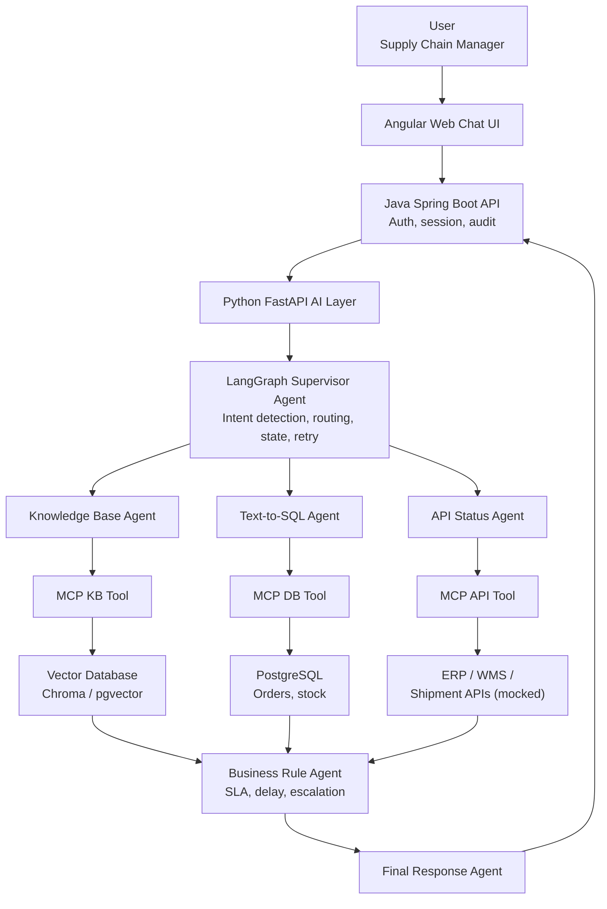

# Technical Requirements Document (TRD)

## Project: Supply Chain Intelligence Co-Pilot

Derived from [Product Requirements](./01_product_requirements.md). This
document defines the technical architecture, stack, agent design, and
non-functional engineering requirements.

---

## 1. Architecture Overview



### Layer Responsibilities

| Layer                               | Responsibility                                                             | Owner |
| ----------------------------------- | -------------------------------------------------------------------------- | --- |
| Angular Web UI                      | Chat interface, history, suggested questions, audit view                   | Person 1 (Muralikarthik) |
| Spring Boot API                     | AuthN/AuthZ, session mgmt, request routing, audit persistence              | Person 1 (Muralikarthik) |
| FastAPI AI Layer                    | Bridges Spring Boot to LangGraph, manages LLM calls, formats agent I/O     | Person 2 (Aakash Bala) |
| LangGraph Supervisor                | Orchestrates agent graph: intent → routing → retries → final compose    | Person 3 (Karthik Saravanan) |
| Sub-agents (KB / SQL / API / Rules) | Domain-specific reasoning and tool invocation                              | Person 3 (Karthik Saravanan) |
| MCP Server                          | Exposes DB, vector DB, KB, and external API tools with a standard protocol | Person 2 (Aakash Bala) |
| PostgreSQL                          | System of record for orders, inventory, shipments, invoices, audit log     | Person 2 (Aakash Bala) |
| Vector DB                           | Embeddings store for SOP/SLA/policy documents (Chroma or pgvector)         | Person 3 (Karthik Saravanan) — content/ingestion; Person 2 — hosting |

---

## 2. Technology Stack

| Layer               | Technology                       | Notes                                                          |
| ------------------- | -------------------------------- | -------------------------------------------------------------- |
| Frontend            | Angular (latest LTS)             | Standalone components, RxJS for streaming chat responses       |
| Backend             | Java Spring Boot 3.x             | REST controllers, Spring Security (JWT), JPA/Hibernate         |
| AI Service          | Python FastAPI                   | Async endpoints, Pydantic models                               |
| Agent Framework     | LangGraph                        | State graph with typed state, conditional edges                |
| Tool Connectivity   | MCP Server + MCP Client (Python) | One MCP server exposing DB/KB/API tools                        |
| LLM                 | Qwen / Llama / GPT (pluggable)   | Accessed via LangChain-compatible chat model wrapper           |
| Knowledge Base      | RAG pipeline                     | Chunking + embedding + retrieval                               |
| Vector Database     | ChromaDB or pgvector             | Chosen based on team preference; pgvector reuses PostgreSQL    |
| Relational Database | PostgreSQL 15+                   | Primary transactional + audit store                            |
| API Integration     | REST (mocked ERP/WMS/TMS)        | Implemented as separate mock FastAPI/Express service(s)        |
| Authentication      | JWT (access + refresh) / OAuth2  | Issued by Spring Boot                                          |
| Monitoring          | OpenTelemetry + Grafana          | Traces spans across Spring Boot → FastAPI → LangGraph → MCP |
| Deployment          | Docker + Docker Compose          | One container per service, single compose file for local demo  |

---

## 3. LangGraph Agent Design

### 3.1 Graph State Schema (conceptual)

```python
class CoPilotState(TypedDict):
    session_id: str
    user_id: str
    raw_query: str
    intent: str                 # e.g. "order_status", "inventory", "sop_lookup", "report"
    sub_intents: list[str]      # multiple agents may be required
    kb_result: dict | None
    sql_result: dict | None
    api_result: dict | None
    rule_result: dict | None
    retry_count: dict[str, int]
    final_response: str | None
    error: str | None
```

### 3.2 Nodes

| Node                     | Responsibility                                                                     | Owner |
| ------------------------ | ---------------------------------------------------------------------------------- | --- |
| `intent_classifier`    | Classifies query into one or more intents using LLM + few-shot prompt              | Person 3 (Karthik Saravanan) |
| `knowledge_base_agent` | Calls MCP KB tool, retrieves top-k chunks, summarizes with citations               | Person 3 (Karthik Saravanan) |
| `text_to_sql_agent`    | Generates SQL, validates (read-only, whitelisted tables), executes via MCP DB tool | Person 3 (Karthik Saravanan) |
| `api_status_agent`     | Calls MCP API tool(s) for shipment/inventory/order status                          | Person 3 (Karthik Saravanan) |
| `business_rule_agent`  | Applies SLA/delay rules using DB + API results                                     | Person 3 (Karthik Saravanan) |
| `final_response_agent` | Merges all agent outputs into structured natural-language answer                   | Person 3 (Karthik Saravanan) |
| `error_handler`        | Catches tool failures, applies retry policy, produces graceful fallback message    | Person 3 (Karthik Saravanan) — retry policy; Person 2 — underlying tool error normalization |

All LangGraph nodes above are owned end-to-end by **Person 3
(Karthik Saravanan)**, per the "AI Intelligence & Orchestration
Engineer" branch in `docs/team_plan.md`. Person 2 owns the MCP tools
these nodes call (Section 4 below); Person 1 owns rendering the
`final_response_agent` output in the UI.

### 3.3 Edges / Control Flow

- `intent_classifier` → conditional edge to one, two, or all three of
  `knowledge_base_agent`, `text_to_sql_agent`, `api_status_agent`
  (parallel fan-out where intent requires multiple sources).
- All data-gathering agents → `business_rule_agent` (only invoked when
  intent involves delay/SLA/status; otherwise bypassed).
- `business_rule_agent` / direct agents → `final_response_agent`.
- Any node → `error_handler` on exception; `error_handler` retries the
  failed node up to **1 retry**, then routes to `final_response_agent`
  with a degraded/partial-answer flag.

### 3.4 Retry & Fallback Policy

- Each tool call node tracks `retry_count[node_name]`.
- Max 1 automatic retry per node per query.
- On second failure: mark that data source as unavailable, continue
  with partial data, and clearly say so in the final response (never
  silently omit).

### 3.5 Human-in-the-Loop (Optional/Stretch)

- LangGraph `interrupt` before `business_rule_agent` triggers an
  escalation/notification action, requiring UI confirmation before
  the graph resumes. Implemented only if time permits (see
  Implementation Plan Phase 8).

---

## 4. MCP Server Design

### 4.1 Tools Exposed

| Tool name               | Backing system     | Input                          | Output                                  | Owner |
| ----------------------- | ------------------ | ------------------------------ | --------------------------------------- | --- |
| `kb_search`           | Vector DB          | `{query: str, top_k: int}`   | list of`{content, source_doc, score}` | Person 2 (Aakash Bala) |
| `db_query`            | PostgreSQL         | `{sql: str}` (pre-validated) | rows as list of dicts                   | Person 2 (Aakash Bala) |
| `get_order_status`    | Mock ERP API       | `{order_no: str}`            | order status JSON                       | Person 2 (Aakash Bala) |
| `get_shipment_status` | Mock Shipment API  | `{tracking_no: str}`         | shipment status JSON                    | Person 2 (Aakash Bala) |
| `get_inventory`       | Mock Inventory API | `{sku: str}`                 | stock JSON                              | Person 2 (Aakash Bala) |

All MCP tools and the MCP server itself are owned by **Person 2
(Aakash Bala)**, per the "AI Platform & Tooling Engineer" branch in
`docs/team_plan.md`. Person 3's agents (Section 3.2) are consumers of
these tools, not owners of them.

### 4.2 Requirements

- MCP server must run as an independent process/container, callable by
  the FastAPI AI layer via MCP client.
- Every tool call must be logged (tool name, input, output size/hash,
  latency, success/failure) for audit purposes.
- `db_query` tool must reject any SQL containing
  `INSERT|UPDATE|DELETE|DROP|ALTER|TRUNCATE` (case-insensitive) before
  execution — defense in depth in addition to Text-to-SQL Agent's own
  validation.
- Tools should be independently testable (unit tests hit each tool
  function directly, without going through LangGraph).

---

## 5. Text-to-SQL Requirements

1. LLM generates SQL from a **fixed, documented schema** (see
   [Backend Schema](./06_backend_schema.md)) provided in the prompt
   context — never from live schema introspection at runtime (for
   determinism and security).
2. Only `SELECT` statements against an allow-listed set of
   tables/views are permitted.
3. Generated SQL must be parsed (e.g., via `sqlglot` or similar) and
   validated before execution — reject on parse failure or
   disallowed keywords/tables.
4. Query results are capped (e.g., `LIMIT 200`) to avoid oversized
   responses; if the user's question implies aggregation, the LLM
   should prefer `GROUP BY`/aggregate SQL over raw row dumps.
5. On validation failure, the agent must retry generation once with
   the error appended to context, then fall back to an error message
   if it fails again.

---

## 6. Knowledge Base / RAG Requirements

1. Source documents: SOP, SLA, and policy files (PDF/Markdown/Word)
   stored in `knowledge_documents` table + raw files on disk/object
   storage.
2. Ingestion pipeline: load → chunk (e.g., 500–800 tokens with
   overlap) → embed → upsert into vector DB with metadata
   (`doc_id`, `title`, `section`, `source_path`).
3. Retrieval: top-k (default k=4) similarity search; results must
   include source citation returned to the Final Response Agent.
4. Re-ingestion must be idempotent (re-running ingestion on an
   unchanged document must not duplicate vectors).

---

## 7. API Integration Requirements

- Mock ERP/WMS/TMS/Shipment APIs implemented as a separate lightweight
  service (FastAPI or JSON-server) returning realistic sample payloads
  keyed by order number / tracking number / SKU.
- API Status Agent must handle non-200 responses and timeouts
  gracefully (configurable timeout, e.g., 5s) and report a clear
  "service unavailable" status rather than crashing the graph.
- All API calls proxied through the MCP API tool — agents never call
  external HTTP endpoints directly.

---

## 8. Security Requirements

- JWT-based authentication issued by Spring Boot; access token short-lived
  (e.g., 15 min), refresh token longer-lived (e.g., 7 days).
- Role-based access: `USER` (chat + own history) and `ADMIN` (chat +
  audit log view across all users).
- Spring Boot is the only layer that terminates user-facing auth;
  FastAPI AI layer trusts a signed internal service token or mTLS from
  Spring Boot (not exposed publicly).
- Database access for the Text-to-SQL Agent uses a **read-only DB
  role**, distinct from the role used for audit-log writes.
- No secrets (DB passwords, API keys, LLM keys) committed to source;
  use `.env` files excluded via `.gitignore` and Docker secrets/env
  vars.

---

## 9. Observability Requirements

- OpenTelemetry instrumentation on: Spring Boot controllers, FastAPI
  endpoints, each LangGraph node, each MCP tool call.
- Trace propagation: a single `trace_id` per user query flows through
  all layers and is stored alongside the audit log entry for
  correlation.
- Grafana dashboard (or equivalent) showing: average response latency,
  per-agent latency breakdown, tool failure rate.

---

## 10. Deployment Requirements

- `docker-compose.yml` with services: `frontend`, `backend`
  (Spring Boot), `ai-service` (FastAPI), `mcp-server`, `mock-apis`,
  `postgres`, `vector-db` (if not using pgvector), `otel-collector`
  (optional), `grafana` (optional).
- All services must start with a single `docker compose up` and seed
  data must load automatically (via init SQL scripts / seed job).
- Environment-specific config via `.env` file at repo root.

---

## 11. Testing Requirements

| Test type         | Scope                                                                                        |
| ----------------- | -------------------------------------------------------------------------------------------- |
| Unit tests        | MCP tools, SQL validator, SLA rule engine, intent classifier prompt outputs (snapshot-based) |
| Integration tests | LangGraph graph end-to-end with mocked tool responses                                        |
| Contract tests    | Spring Boot ↔ FastAPI request/response schemas                                              |
| E2E tests         | Angular UI → full stack → response, for the main use case (Section 6 of problem statement) |
| Security tests    | Confirm Text-to-SQL Agent cannot execute write/DDL statements                                |

---

## 12. Related Documents

- [Product Requirements](./01_product_requirements.md)
- [Implementation Plan](./03_implementation_plan.md)
- [UI/UX Design](./04_ui_ux_design.md)
- [App Flow](./05_app_flow.md)
- [Backend Schema](./06_backend_schema.md)

---

## 13. Team Ownership

Per `docs/team_plan.md`, this technical design splits cleanly across
the 3-person team by architectural layer:

| Team Member | Branch | Owns in this document |
|---|---|---|
| Muralikarthik (Person 1) | Application Engineer | Angular Web UI, Spring Boot API, JWT/OAuth2 auth (Sections 1, 8 security items owned by Spring Boot) |
| Aakash Bala (Person 2) | AI Platform & Tooling Engineer | FastAPI AI Layer, MCP Server + all tools (Section 4), PostgreSQL, mock APIs, deployment/Docker (Sections 7, 10), tool-level safety |
| Karthik Saravanan (Person 3) | AI Intelligence & Orchestration Engineer | LangGraph Supervisor and all agent nodes (Section 3), Text-to-SQL prompt/validation logic (Section 5), RAG design (Section 6) |

**Cross-cutting / shared:** Observability (Section 9) and Testing
(Section 11) are shared responsibilities — each person instruments
and tests their own layer, but end-to-end tracing and E2E tests are a
joint effort during the integration phase (Days 11–13 per
`docs/team_plan.md`).

**Non-negotiable contract freeze (Day 1):** the LangGraph state
schema (Section 3.1), the MCP tool signatures (Section 4.1), and the
database schema referenced in Section 5 must be agreed upon by all
three members before implementation begins — these are the hard
interfaces between the three ownership tracks.
