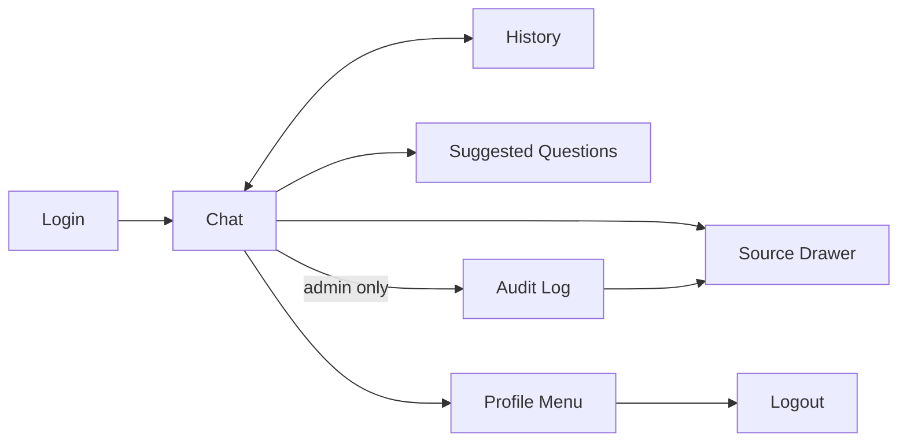

# UI/UX Design Document

## Project: Supply Chain Intelligence Co-Pilot

Derived from [Product Requirements](./01_product_requirements.md).
Defines screens, layout, components, and interaction patterns for the
Angular frontend.

------------------------------------------------------------------------

## 1. Design Principles

1. **Answer first, data second** — lead with a plain-language answer;
   raw tables/JSON are supporting detail, not the headline.
2. **Always show provenance** — every answer must visibly indicate
   whether it came from the Knowledge Base, Database, or an External
   API, so users trust the response.
3. **Action-oriented** — delay/SLA answers must surface a clear,
   numbered recommended-action list, not just a status.
4. **Low friction onboarding** — a first-time user should be able to
   ask a useful question within 10 seconds via suggested prompts.
5. **Transparency for admins** — the audit view should make it trivial
   to trace any answer back to its underlying tool calls.

------------------------------------------------------------------------

## 2. Screen Inventory

| # | Screen | Access | Purpose | Built By | Team Plan Task |
|---|---|---|---|---|---|
| 1 | Login | Public | Authenticate user (JWT/OAuth2) | Person 1 (Muralikarthik) | P1.6 |
| 2 | Chat (main) | Authenticated | Ask questions, view answers | Person 1 (Muralikarthik) | P1.3, P1.5, P1.9 |
| 3 | Query History | Authenticated | Browse past queries/answers | Person 1 (Muralikarthik) | P1.7 |
| 4 | Suggested Questions (panel within Chat) | Authenticated | Onboarding / discoverability | Person 1 (Muralikarthik) | P1.3 |
| 5 | Result Detail / Source Drawer | Authenticated | Inspect SQL/API/KB source behind an answer | Person 1 (Muralikarthik) — UI; data supplied by Person 2/3's response payload | P1.9 |
| 6 | Audit Log | Admin only | Search/filter full audit trail | Person 1 (Muralikarthik) | P1.8 |
| 7 | Session/Profile menu | Authenticated | Logout, view session info | Person 1 (Muralikarthik) | P1.6 |

All screens in this document are owned end-to-end by **Person 1
(Muralikarthik)** — Application Engineer — per `docs/team_plan.md`.
The "Team Plan Task" column references that document's task IDs
(e.g., `P1.3`) so this UI/UX spec and the day-by-day plan stay in
sync.

------------------------------------------------------------------------

## 3. Screen Details

### 3.1 Login Screen
- Fields: username/email, password (or OAuth2 SSO button if configured).
- Error state: inline message on invalid credentials.
- On success → redirect to Chat screen.

**Layout (wireframe description):**
```
┌───────────────────────────────┐
│         [ Logo / Title ]      │
│                                │
│   Email:    [______________]  │
│   Password: [______________]  │
│                                │
│         [   Sign In   ]       │
│                                │
│   (OAuth2 SSO button, if any) │
└───────────────────────────────┘
```

### 3.2 Chat Screen (Main / Primary Screen)

**Layout:**
```
┌───────────┬───────────────────────────────────────────┬────────────┐
│  Sidebar  │              Chat Conversation             │  Suggested │
│ - History │  ┌───────────────────────────────────────┐ │  Questions │
│ - Audit*  │  │ [User] Where is order SO-45892...      │ │  panel     │
│ - Profile │  └───────────────────────────────────────┘ │ (collapses │
│           │  ┌───────────────────────────────────────┐ │  on mobile)│
│           │  │ [Assistant]                            │ │            │
│           │  │  Status card + Reason + Impact +       │ │            │
│           │  │  Recommended Action list                │ │            │
│           │  │  [View sources ▾]                       │ │            │
│           │  └───────────────────────────────────────┘ │            │
│           │  [ Type your question...        ] [Send]  │ │            │
└───────────┴───────────────────────────────────────────┴────────────┘
* Audit link visible only to admin role.
```

**Assistant response card structure** (maps directly to Final Response
Agent output and the sample in the problem statement Section 7):
1. **Headline** — one-line summary (e.g., "Order SO-45892 has been
   dispatched from the warehouse.")
2. **Current Status** — short paragraph.
3. **Reason for Delay** (only if applicable) — short paragraph.
4. **Impact** — small key/value table: Promised Date, Revised ETA,
   Delay (days), SLA Result (badge: On Time / At Risk / Breached).
5. **Recommended Action** — numbered list.
6. **Source badges** — small pills: `KB`, `DB`, `API` indicating which
   agents contributed, clickable to expand the Source Drawer (3.5).
7. **Timestamp** and a **regenerate/retry** icon button.

**Interaction states:**
- Typing indicator ("Thinking...") while the LangGraph workflow runs,
  ideally with incremental status (e.g., "Checking shipment status...",
  "Checking SLA policy...") if streaming is implemented.
- Error state: if a data source failed, show a small warning inline
  ("Shipment API unavailable — answer based on database records
  only.") rather than failing the whole response.

### 3.3 Query History Screen
- List of past queries (most recent first), each showing: question
  text, timestamp, one-line answer summary.
- Clicking an item reopens the full conversation turn in the Chat
  screen (read-only replay).
- Search/filter box by keyword or date range.

### 3.4 Suggested Questions Panel
- Static + dynamic list of example prompts, grouped by category:
  - Order & Shipment Status
  - Inventory Availability
  - SLA & Delay Policy
  - Reporting (e.g., "Show delayed orders from Chennai warehouse")
- Clicking a suggestion pre-fills (and optionally auto-sends) the chat
  input.

### 3.5 Result Detail / Source Drawer
Slide-out panel triggered by "View sources" on an assistant message.
Tabs:
- **Database tab** — generated SQL (syntax-highlighted, read-only) +
  result table.
- **API tab** — API endpoint called + raw JSON response (collapsed by
  default).
- **Knowledge Base tab** — retrieved document excerpts with source
  document name/section link.

This is primarily for power users and QA/demo purposes, but reinforces
trust for all users.

### 3.6 Audit Log Screen (Admin only)
- Table view: timestamp, user, question, intent, agents invoked,
  SLA result, link to full trace.
- Filters: user, date range, intent type, SLA breach only.
- Row expand → same Source Drawer content as 3.5, plus full LangGraph
  trace_id for cross-referencing with Grafana/OpenTelemetry.

------------------------------------------------------------------------

## 4. Navigation Flow



------------------------------------------------------------------------

## 5. Component Library (Angular)

| Component | Purpose |
|---|---|
| `ChatWindowComponent` | Renders conversation thread, manages scroll/streaming |
| `ChatInputComponent` | Text input + send button + suggestion chip insert |
| `ResponseCardComponent` | Renders structured assistant answer (status/reason/impact/action) |
| `SourceBadgeComponent` | Small KB/DB/API pill, opens Source Drawer |
| `SourceDrawerComponent` | Tabbed drawer: SQL, API JSON, KB excerpts |
| `SlaBadgeComponent` | Colored badge: On Time (green) / At Risk (amber) / Breached (red) |
| `HistoryListComponent` | Past query list with search |
| `SuggestedQuestionsComponent` | Categorized prompt chips |
| `AuditTableComponent` | Filterable/sortable audit log table |
| `AuthGuard` / `AdminGuard` | Route guards for authenticated/admin-only routes |

------------------------------------------------------------------------

## 6. Visual/Style Guidelines (placeholder — align with team's design system)

- **Typography:** system font stack or a single clean sans-serif
  (e.g., Inter); one size scale for headline/body/caption.
- **Color semantics:**
  - Green — on-time / success
  - Amber — at-risk / warning
  - Red — SLA breach / error
  - Neutral gray — informational badges (KB/DB/API source pills)
- **Chat bubbles:** user messages right-aligned/solid; assistant
  messages left-aligned/card-style to accommodate structured content
  (not a simple text bubble, since answers include tables/badges).
- Keep to a **single accent color** for interactive elements (buttons,
  links, suggestion chips) to avoid visual noise around the status
  badges' semantic colors.

------------------------------------------------------------------------

## 7. Accessibility

- All interactive elements keyboard-navigable (tab order: input →
  send → suggestions → history).
- SLA badges must not rely on color alone — include text label
  ("Breached", "At Risk", "On Time").
- Sufficient contrast ratio (WCAG AA) for status badges and chat text.
- Source Drawer and modals must trap focus and be closeable via Esc.

------------------------------------------------------------------------

## 8. Responsive Behavior

- **Desktop (≥1024px):** 3-column layout (sidebar, chat, suggestions).
- **Tablet (600–1023px):** 2-column (sidebar collapses to icon rail,
  suggestions panel becomes a toggleable drawer).
- **Mobile (<600px):** single column; history/audit/suggestions
  accessible via bottom nav or hamburger menu; Source Drawer becomes
  full-screen modal.

------------------------------------------------------------------------

## 9. Related Documents

- [Product Requirements](./01_product_requirements.md)
- [Technical Requirements](./02_technical_requirements.md)
- [Implementation Plan](./03_implementation_plan.md)
- [App Flow](./05_app_flow.md)
- [Backend Schema](./06_backend_schema.md)

------------------------------------------------------------------------

## 10. Team Ownership

| Team Member | Branch | Relevance to this document |
|---|---|---|
| **Muralikarthik (Person 1)** | Application Engineer | Owns and builds every screen, component, and interaction in this document (Angular + Spring Boot presentation layer) |
| Aakash Bala (Person 2) | AI Platform & Tooling Engineer | Supplies the `/ai/query` response contract this UI renders (Section 3.2 response card) and the audit data shape (Section 3.6) |
| Karthik Saravanan (Person 3) | AI Intelligence & Orchestration Engineer | Owns the final structured response schema (status, reason, impact, recommended actions, sources) that drives the Response Card and Source Drawer designs |

**Day mapping (from `docs/team_plan.md`):**

| Doc Section | Team Plan Task | Day |
|---|---|---|
| 3.1 Login Screen | P1.6 Authentication and Sessions | Day 6 |
| 3.2 Chat Screen (mock data) | P1.3 Complete Chat Interface | Day 3 |
| 3.2 Chat Screen (real integration) | P1.5 Application Integration | Day 5 |
| 3.2 Response Card (structured) | P1.9 Structured AI Response UI | Day 9 |
| 3.3 Query History Screen | P1.7 Query History | Day 7 |
| 3.6 Audit Log Screen | P1.8 Audit View | Day 8 |
| Full UI ↔ real AI pipeline | P1.10 Final Application Integration | Day 11 |

**How to apply:** Person 1 should build Section 3.2's chat UI against
mock data first (per P1.3), then wire it to Person 2/3's real
endpoints only once the response schema in
[Technical Requirements Section 3.1](./02_technical_requirements.md#31-graph-state-schema-conceptual)
is frozen — this avoids rework if the schema shifts during Days 5–9.