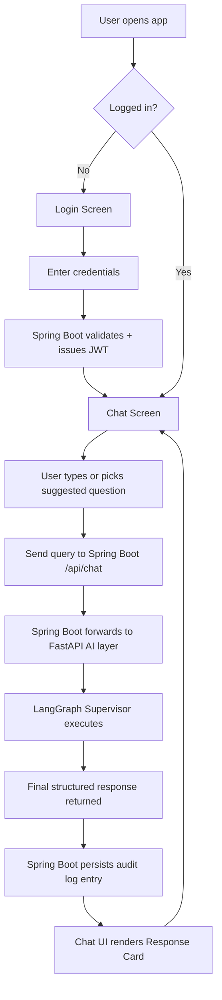
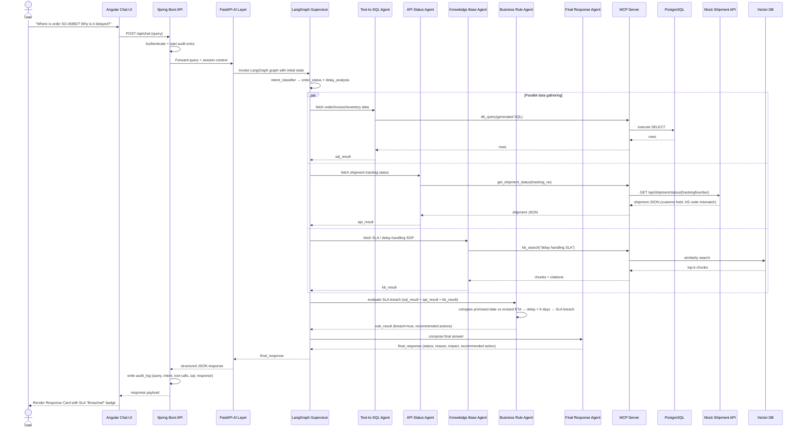
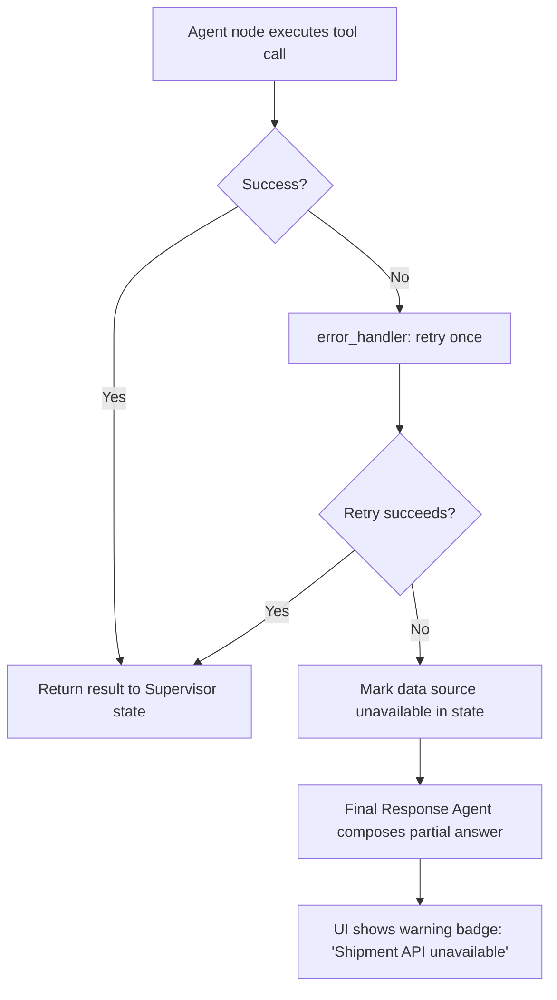
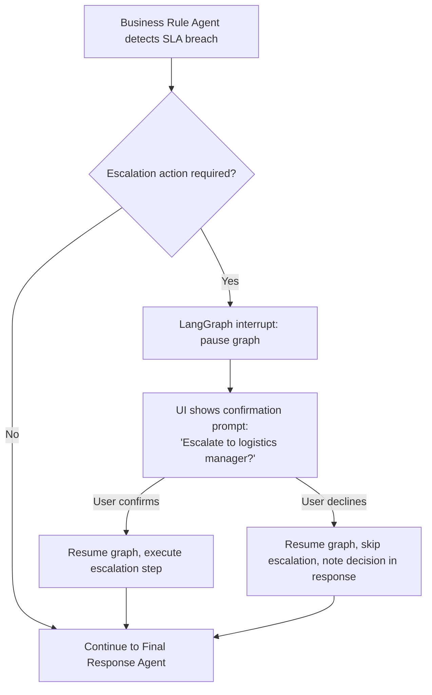
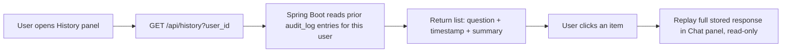

# App Flow Document

## Project: Supply Chain Intelligence Co-Pilot

Derived from [Product Requirements](./01_product_requirements.md) and
[Technical Requirements](./02_technical_requirements.md). Describes
end-to-end user and system flows, including the main use case, error
handling, and audit logging.

---

## 1. High-Level User Flow

---

## 2. Main Use Case Sequence: "Where is order SO-45892? Why is it delayed?"

This follows Section 6–7 of `docs/problem_statement.md` exactly.

**Participant ownership** (per `docs/team_plan.md`): `UI` = Person 1
(Muralikarthik); `BE` (Spring Boot) = Person 1; `AI` (FastAPI) = Person 2
(Aakash Bala); `SV`, `SQL`, `API`, `KB`, `RULE`, `FIN` (LangGraph
Supervisor and all agents) = Person 3 (Karthik Saravanan); `MCP` =
Person 2; `DB`, `EXT`, `VDB` = Person 2 (hosting/mocking). This
sequence diagram is therefore the single clearest illustration of how
all three ownership tracks interlock on the flagship demo.

---

## 3. Intent Routing Decision Table

| User question pattern                            | Detected intent               | Agents invoked                                                    | Owner                                                             |
| ------------------------------------------------ | ----------------------------- | ----------------------------------------------------------------- | ----------------------------------------------------------------- |
| "Where is order X / shipment X"                  | order_status                  | Text-to-SQL + API Status                                          | Person 3 (agent logic) / Person 2 (MCP tools)                     |
| "Why is order X delayed"                         | delay_analysis                | Text-to-SQL + API Status + Business Rule                          | Person 3 (agent logic) / Person 2 (MCP tools)                     |
| "What is the SLA / SOP for X"                    | sop_lookup                    | Knowledge Base                                                    | Person 3 (agent logic) / Person 2 (MCP tools + vector DB hosting) |
| "Show delayed orders from warehouse X"           | report                        | Text-to-SQL only                                                  | Person 3 (agent logic) / Person 2 (DB + MCP tool)                 |
| "Is SKU X in stock"                              | inventory                     | API Status (or Text-to-SQL if inventory table is source of truth) | Person 3 (agent logic) / Person 2 (MCP tools)                     |
| Combination question (e.g., full use case above) | order_status + delay_analysis | All three + Business Rule                                         | Person 3 (all agent logic) / Person 2 (all underlying tools)      |

The Supervisor may invoke multiple intents for a single query if the
LLM classifier detects more than one need (e.g., status **and**
delay reason **and** recommended action, as in the main use case).

---

## 4. Error / Degraded-Path Flow

**Rule:** the system must never silently drop a failed source — the
final response must explicitly state which source could not be
reached, and answer with whatever data is available.

---

## 5. Human-in-the-Loop Flow (Optional/Stretch)

---

## 6. Audit Logging Flow

Every query produces exactly one `audit_log` row containing:

1. `trace_id` (correlates with OpenTelemetry span across all layers).
2. `user_id`, `session_id`, `timestamp`.
3. `raw_query` (verbatim user text).
4. `detected_intent` (JSON array of intents).
5. `agents_invoked` (JSON array: which of KB/SQL/API/Rule ran).
6. `generated_sql` (nullable — only if Text-to-SQL Agent ran).
7. `api_calls` (JSON array of endpoint + status code + latency).
8. `kb_sources` (JSON array of cited document ids).
9. `final_response` (the rendered answer text).
10. `sla_result` (On Time / At Risk / Breached / N/A).

This maps directly to the `audit_log` table in
[Backend Schema](./06_backend_schema.md) and is what powers the
Audit Log screen in [UI/UX Design](./04_ui_ux_design.md).

---

## 7. Query History Flow

History reuses `audit_log` as its data source (filtered to the
requesting user's own entries) rather than a separate table, keeping
a single source of truth for "what was asked and answered."

---

## 8. Related Documents

- [Product Requirements](./01_product_requirements.md)
- [Technical Requirements](./02_technical_requirements.md)
- [Implementation Plan](./03_implementation_plan.md)
- [UI/UX Design](./04_ui_ux_design.md)
- [Backend Schema](./06_backend_schema.md)

---

## 9. Team Ownership

This document is the flow-level view of the whole system, so no
single person owns it — instead, each flow section is a handoff point
between the three tracks defined in `docs/team_plan.md`:

| Section                          | Primary Owner(s)                                                              | Notes                                                                                  |
| -------------------------------- | ----------------------------------------------------------------------------- | -------------------------------------------------------------------------------------- |
| 1. High-Level User Flow          | Person 1 (UI/BE steps) + Person 2/3 (AI steps)                                | Spans the whole stack                                                                  |
| 2. Main Use Case Sequence        | Person 3 (Supervisor + agents) + Person 2 (MCP/DB/API) + Person 1 (UI in/out) | The canonical flagship-demo reference — must stay accurate as all three tracks change |
| 3. Intent Routing Decision Table | Person 3 (routing logic)                                                      | Person 2 supplies the tools invoked                                                    |
| 4. Error / Degraded-Path Flow    | Person 3 (retry/error_handler) + Person 2 (tool-level error normalization)    |                                                                                        |
| 5. Human-in-the-Loop Flow        | Person 3 (graph interrupt) + Person 1 (confirmation UI)                       | Optional/stretch scope                                                                 |
| 6. Audit Logging Flow            | Person 1 (persistence + audit view)                                           | Populated with data from Person 2 (tool calls) and Person 3 (intents/response)         |
| 7. Query History Flow            | Person 1                                                                      | Reuses`audit_log`, owned by Person 1                                                 |

**How to apply:** whenever the Main Use Case Sequence (Section 2)
changes — e.g., a new agent is added or a tool call is reordered — the
person changing it must notify the other two, since this diagram is
the shared contract referenced by `docs/team_plan.md`'s Day 9 and
Day 11 completion gates ("multi-agent evidence gathering works" and
"complete end-to-end flow works").
