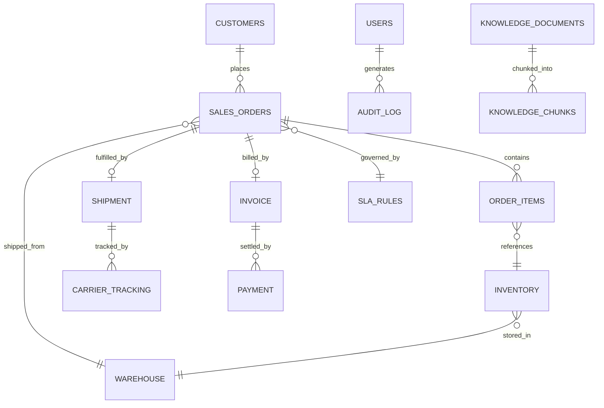

# Backend Schema Document

## Project: Supply Chain Intelligence Co-Pilot

Derived from [Technical Requirements](./02_technical_requirements.md)
Section 10 (Database Tables) and Section 5 (Text-to-SQL
Requirements). This is the fixed, documented PostgreSQL schema that
the Text-to-SQL Agent's prompt context is built from — it must stay in
sync with actual migrations in `db/migrations/`.

------------------------------------------------------------------------

## 1. Entity Relationship Overview



------------------------------------------------------------------------

## 2. Table Definitions (DDL)

### 2.1 `customers`

```sql
CREATE TABLE customers (
    customer_id     SERIAL PRIMARY KEY,
    customer_code   VARCHAR(20) UNIQUE NOT NULL,
    customer_name   VARCHAR(150) NOT NULL,
    contact_email   VARCHAR(150),
    contact_phone   VARCHAR(30),
    region          VARCHAR(50),
    sla_tier        VARCHAR(20) DEFAULT 'STANDARD', -- STANDARD, GOLD, PLATINUM
    created_at      TIMESTAMP NOT NULL DEFAULT now()
);
```

### 2.2 `warehouse`

```sql
CREATE TABLE warehouse (
    warehouse_id    SERIAL PRIMARY KEY,
    warehouse_code  VARCHAR(20) UNIQUE NOT NULL,
    warehouse_name  VARCHAR(150) NOT NULL,
    location        VARCHAR(100) NOT NULL,  -- e.g. 'Chennai'
    address         TEXT,
    created_at      TIMESTAMP NOT NULL DEFAULT now()
);
```

### 2.3 `sales_orders`

```sql
CREATE TABLE sales_orders (
    order_id                SERIAL PRIMARY KEY,
    order_no                VARCHAR(20) UNIQUE NOT NULL,   -- e.g. 'SO-45892'
    customer_id             INT NOT NULL REFERENCES customers(customer_id),
    warehouse_id            INT NOT NULL REFERENCES warehouse(warehouse_id),
    order_date              DATE NOT NULL,
    promised_delivery_date  DATE NOT NULL,
    revised_delivery_date   DATE,
    current_status          VARCHAR(30) NOT NULL,  -- Pending, Dispatched, In Transit, Delayed, Delivered, Cancelled
    total_amount            NUMERIC(12,2) NOT NULL,
    created_at              TIMESTAMP NOT NULL DEFAULT now(),
    updated_at              TIMESTAMP NOT NULL DEFAULT now()
);

CREATE INDEX idx_sales_orders_status ON sales_orders(current_status);
CREATE INDEX idx_sales_orders_warehouse ON sales_orders(warehouse_id);
```

### 2.4 `order_items`

```sql
CREATE TABLE order_items (
    order_item_id   SERIAL PRIMARY KEY,
    order_id        INT NOT NULL REFERENCES sales_orders(order_id),
    sku             VARCHAR(30) NOT NULL,
    product_name    VARCHAR(150) NOT NULL,
    quantity        INT NOT NULL,
    unit_price      NUMERIC(10,2) NOT NULL
);

CREATE INDEX idx_order_items_order ON order_items(order_id);
CREATE INDEX idx_order_items_sku ON order_items(sku);
```

### 2.5 `inventory`

```sql
CREATE TABLE inventory (
    inventory_id     SERIAL PRIMARY KEY,
    sku              VARCHAR(30) UNIQUE NOT NULL,
    product_name     VARCHAR(150) NOT NULL,
    warehouse_id     INT NOT NULL REFERENCES warehouse(warehouse_id),
    quantity_on_hand INT NOT NULL DEFAULT 0,
    quantity_reserved INT NOT NULL DEFAULT 0,
    reorder_level    INT NOT NULL DEFAULT 0,
    updated_at       TIMESTAMP NOT NULL DEFAULT now()
);

CREATE INDEX idx_inventory_warehouse ON inventory(warehouse_id);
```

### 2.6 `shipment`

```sql
CREATE TABLE shipment (
    shipment_id       SERIAL PRIMARY KEY,
    order_id          INT NOT NULL REFERENCES sales_orders(order_id),
    tracking_no       VARCHAR(30) UNIQUE NOT NULL,
    carrier_name      VARCHAR(100),
    dispatch_date     DATE,
    current_location  VARCHAR(150),   -- e.g. 'Chennai Port'
    shipment_status   VARCHAR(30),    -- Dispatched, In Transit, Customs Hold, Delivered
    delay_reason      TEXT,           -- e.g. 'HS code mismatch during customs validation'
    created_at        TIMESTAMP NOT NULL DEFAULT now(),
    updated_at        TIMESTAMP NOT NULL DEFAULT now()
);

CREATE INDEX idx_shipment_order ON shipment(order_id);
CREATE INDEX idx_shipment_status ON shipment(shipment_status);
```

### 2.7 `carrier_tracking`

```sql
CREATE TABLE carrier_tracking (
    tracking_event_id  SERIAL PRIMARY KEY,
    shipment_id        INT NOT NULL REFERENCES shipment(shipment_id),
    event_timestamp    TIMESTAMP NOT NULL,
    event_location     VARCHAR(150),
    event_status       VARCHAR(100),   -- e.g. 'Arrived at port', 'Customs hold'
    raw_payload        JSONB           -- raw carrier API response snapshot
);

CREATE INDEX idx_carrier_tracking_shipment ON carrier_tracking(shipment_id);
```

### 2.8 `invoice`

```sql
CREATE TABLE invoice (
    invoice_id      SERIAL PRIMARY KEY,
    order_id        INT NOT NULL REFERENCES sales_orders(order_id),
    invoice_no      VARCHAR(20) UNIQUE NOT NULL,
    invoice_date    DATE NOT NULL,
    amount          NUMERIC(12,2) NOT NULL,
    invoice_status  VARCHAR(20) NOT NULL   -- Draft, Sent, Paid, Overdue
);

CREATE INDEX idx_invoice_order ON invoice(order_id);
```

### 2.9 `payment`

```sql
CREATE TABLE payment (
    payment_id      SERIAL PRIMARY KEY,
    invoice_id      INT NOT NULL REFERENCES invoice(invoice_id),
    payment_date    DATE,
    amount_paid     NUMERIC(12,2) NOT NULL,
    payment_method  VARCHAR(30),   -- Bank Transfer, Card, Cheque
    payment_status  VARCHAR(20)    -- Pending, Completed, Failed
);

CREATE INDEX idx_payment_invoice ON payment(invoice_id);
```

### 2.10 `sla_rules`

```sql
CREATE TABLE sla_rules (
    sla_rule_id      SERIAL PRIMARY KEY,
    sla_tier         VARCHAR(20) NOT NULL,   -- STANDARD, GOLD, PLATINUM
    max_delay_days   INT NOT NULL,           -- delay threshold before breach
    escalation_role  VARCHAR(50) NOT NULL,   -- e.g. 'Logistics Manager'
    description      TEXT
);
```

### 2.11 `knowledge_documents`

```sql
CREATE TABLE knowledge_documents (
    doc_id          SERIAL PRIMARY KEY,
    title           VARCHAR(200) NOT NULL,
    doc_type        VARCHAR(30) NOT NULL,   -- SOP, SLA, POLICY
    source_path     TEXT NOT NULL,          -- file path or object storage key
    version         VARCHAR(20) DEFAULT 'v1',
    uploaded_at     TIMESTAMP NOT NULL DEFAULT now()
);
```

### 2.12 `knowledge_chunks` (metadata mirror of vector DB entries)

```sql
CREATE TABLE knowledge_chunks (
    chunk_id        SERIAL PRIMARY KEY,
    doc_id          INT NOT NULL REFERENCES knowledge_documents(doc_id),
    chunk_index     INT NOT NULL,
    content         TEXT NOT NULL,
    vector_ref_id   VARCHAR(100),  -- id of the corresponding vector in Chroma/pgvector
    created_at      TIMESTAMP NOT NULL DEFAULT now()
);

CREATE INDEX idx_knowledge_chunks_doc ON knowledge_chunks(doc_id);
```

> If using **pgvector** instead of a separate ChromaDB instance, add an
> `embedding VECTOR(1536)` column directly to `knowledge_chunks` and
> create an IVFFlat/HNSW index on it.

### 2.13 `users`

```sql
CREATE TABLE users (
    user_id         SERIAL PRIMARY KEY,
    username        VARCHAR(100) UNIQUE NOT NULL,
    email           VARCHAR(150) UNIQUE NOT NULL,
    password_hash   TEXT NOT NULL,
    role            VARCHAR(20) NOT NULL DEFAULT 'USER',  -- USER, ADMIN
    created_at      TIMESTAMP NOT NULL DEFAULT now()
);
```

### 2.14 `audit_log`

```sql
CREATE TABLE audit_log (
    audit_id         BIGSERIAL PRIMARY KEY,
    trace_id         VARCHAR(64) NOT NULL,
    user_id          INT NOT NULL REFERENCES users(user_id),
    session_id       VARCHAR(64) NOT NULL,
    raw_query        TEXT NOT NULL,
    detected_intent  JSONB,           -- e.g. ["order_status", "delay_analysis"]
    agents_invoked   JSONB,           -- e.g. ["text_to_sql_agent", "api_status_agent", "business_rule_agent"]
    generated_sql    TEXT,
    api_calls        JSONB,           -- e.g. [{"endpoint": "...", "status": 200, "latency_ms": 320}]
    kb_sources       JSONB,           -- e.g. [{"doc_id": 3, "title": "Delay Handling SOP"}]
    final_response   TEXT NOT NULL,
    sla_result       VARCHAR(20),     -- On Time, At Risk, Breached, N/A
    created_at       TIMESTAMP NOT NULL DEFAULT now()
);

CREATE INDEX idx_audit_log_user ON audit_log(user_id);
CREATE INDEX idx_audit_log_created ON audit_log(created_at);
CREATE INDEX idx_audit_log_trace ON audit_log(trace_id);
```

------------------------------------------------------------------------

## 3. Database Roles (Security)

```sql
-- Read-only role used exclusively by the Text-to-SQL Agent / db_query MCP tool
CREATE ROLE copilot_readonly LOGIN PASSWORD '<set-via-env>';
GRANT CONNECT ON DATABASE nexchain TO copilot_readonly;
GRANT USAGE ON SCHEMA public TO copilot_readonly;
GRANT SELECT ON
    customers, sales_orders, order_items, inventory, warehouse,
    shipment, invoice, payment, carrier_tracking, sla_rules,
    knowledge_documents, knowledge_chunks
TO copilot_readonly;
-- Explicitly no SELECT/INSERT/UPDATE/DELETE on audit_log or users for this role.

-- Read/write role used by Spring Boot for auth + audit persistence
CREATE ROLE copilot_app LOGIN PASSWORD '<set-via-env>';
GRANT CONNECT ON DATABASE nexchain TO copilot_app;
GRANT USAGE ON SCHEMA public TO copilot_app;
GRANT SELECT, INSERT ON audit_log TO copilot_app;
GRANT SELECT, INSERT, UPDATE ON users TO copilot_app;
```

------------------------------------------------------------------------

## 4. Text-to-SQL Allow-List

The Text-to-SQL Agent's SQL validator must only permit `SELECT`
statements against these tables/views:

```
customers, sales_orders, order_items, inventory, warehouse,
shipment, invoice, payment, carrier_tracking, sla_rules
```

`users`, `audit_log`, `knowledge_documents`, and `knowledge_chunks` are
**never** exposed to the Text-to-SQL Agent's generated SQL.

> **Ownership note:** this allow-list is a shared contract — Person 2
> (Aakash Bala) owns the table list and the `copilot_readonly` role it
> maps to (Section 3), while Person 3 (Karthik Saravanan) owns the
> validator code in the Text-to-SQL Agent that enforces it. Neither
> side may change the list unilaterally (see `docs/team_plan.md`,
> "shared contracts may not be changed silently").

------------------------------------------------------------------------

## 5. Reference Query (from Problem Statement Section 11)

```sql
SELECT
    so.order_no,
    c.customer_name,
    w.location AS warehouse_location,
    so.promised_delivery_date,
    so.current_status
FROM sales_orders so
JOIN customers c ON c.customer_id = so.customer_id
JOIN warehouse w ON w.warehouse_id = so.warehouse_id
WHERE w.location = 'Chennai'
  AND so.current_status = 'Delayed'
LIMIT 200;
```

------------------------------------------------------------------------

## 6. SLA Breach Calculation (used by Business Rule Agent)

```sql
SELECT
    so.order_no,
    so.promised_delivery_date,
    sh.shipment_status,
    COALESCE(sh.current_location, 'Unknown') AS current_location,
    sh.delay_reason,
    (CURRENT_DATE - so.promised_delivery_date) AS delay_days,
    sr.max_delay_days,
    CASE
        WHEN (CURRENT_DATE - so.promised_delivery_date) > sr.max_delay_days
            THEN 'Breached'
        WHEN (CURRENT_DATE - so.promised_delivery_date) > 0
            THEN 'At Risk'
        ELSE 'On Time'
    END AS sla_result
FROM sales_orders so
JOIN customers c ON c.customer_id = so.customer_id
JOIN sla_rules sr ON sr.sla_tier = c.sla_tier
LEFT JOIN shipment sh ON sh.order_id = so.order_id
WHERE so.order_no = 'SO-45892';
```

This is the logical basis for the "Impact" section (Promised Delivery
Date, Revised ETA, Delay in days, SLA Result) shown in the sample
final output in the problem statement.

------------------------------------------------------------------------

## 7. Seed Data Guidance

For [Implementation Plan](./03_implementation_plan.md) Phase 2, seed
data should include:
- 3–5 customers across different `sla_tier` values.
- 2–3 warehouses (include `Chennai`).
- 30–50 `sales_orders` with a realistic mix of `current_status`
  values, including at least:
  - One order matching the exact demo scenario: `order_no = 'SO-45892'`,
    `promised_delivery_date = 2026-07-03`, shipment `current_location =
    'Chennai Port'`, `shipment_status = 'Customs Hold'`,
    `delay_reason = 'HS code mismatch during customs validation'`,
    revised ETA `2026-07-09` (6-day delay, SLA breach).
  - Several on-time orders.
  - Several "At Risk" (delayed but within SLA threshold) orders.
- Matching `order_items`, `inventory`, `invoice`, and `payment` rows
  for referential completeness.
- `sla_rules`: e.g., STANDARD → 3 days, GOLD → 5 days, PLATINUM → 7
  days, each with an `escalation_role`.
- 5–10 `knowledge_documents` (Delay Handling SOP, Customs Hold
  Procedure, Escalation Matrix, Return Policy, Payment Terms Policy),
  chunked into `knowledge_chunks` and embedded into the vector DB.

------------------------------------------------------------------------

## 8. Related Documents

- [Product Requirements](./01_product_requirements.md)
- [Technical Requirements](./02_technical_requirements.md)
- [Implementation Plan](./03_implementation_plan.md)
- [UI/UX Design](./04_ui_ux_design.md)
- [App Flow](./05_app_flow.md)

------------------------------------------------------------------------

## 9. Team Ownership

| Team Member | Branch | Ownership in this document |
|---|---|---|
| **Aakash Bala (Person 2)** | AI Platform & Tooling Engineer | Owns this entire document: table DDL (Section 2), database roles (Section 3), and seed data (Section 7) — matches P2.1 "Database Design" and P2.2 "PostgreSQL Implementation" in `docs/team_plan.md` |
| Karthik Saravanan (Person 3) | AI Intelligence & Orchestration Engineer | Consumes this schema as fixed prompt context for the Text-to-SQL Agent (Section 4) and as the source for the SLA breach query (Section 6); cannot start P3.5 "Text-to-SQL Agent" until this schema is frozen |
| Muralikarthik (Person 1) | Application Engineer | Consumes the `audit_log` and `users` tables (Section 2.13–2.14) via Spring Boot; does not touch the read-only supply-chain tables directly |

**Critical handoff (Day 1, per `docs/team_plan.md`):** Person 2 must
freeze this schema and get Person 3's sign-off before Person 3 can
begin Text-to-SQL work. Any change to table/column names after Day 1
must be communicated to Person 3 immediately, since the Text-to-SQL
Agent's prompt context is generated directly from this document.

**Seed data ownership:** Section 7's seed data (including the
SO-45892 flagship scenario row) is built by Person 2 during P2.3
"Realistic Dummy Data" (Day 3), and is the shared fixture that Person
3's Text-to-SQL evaluation (P3.6) and Person 1's demo/testing both
depend on.