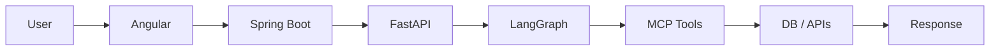
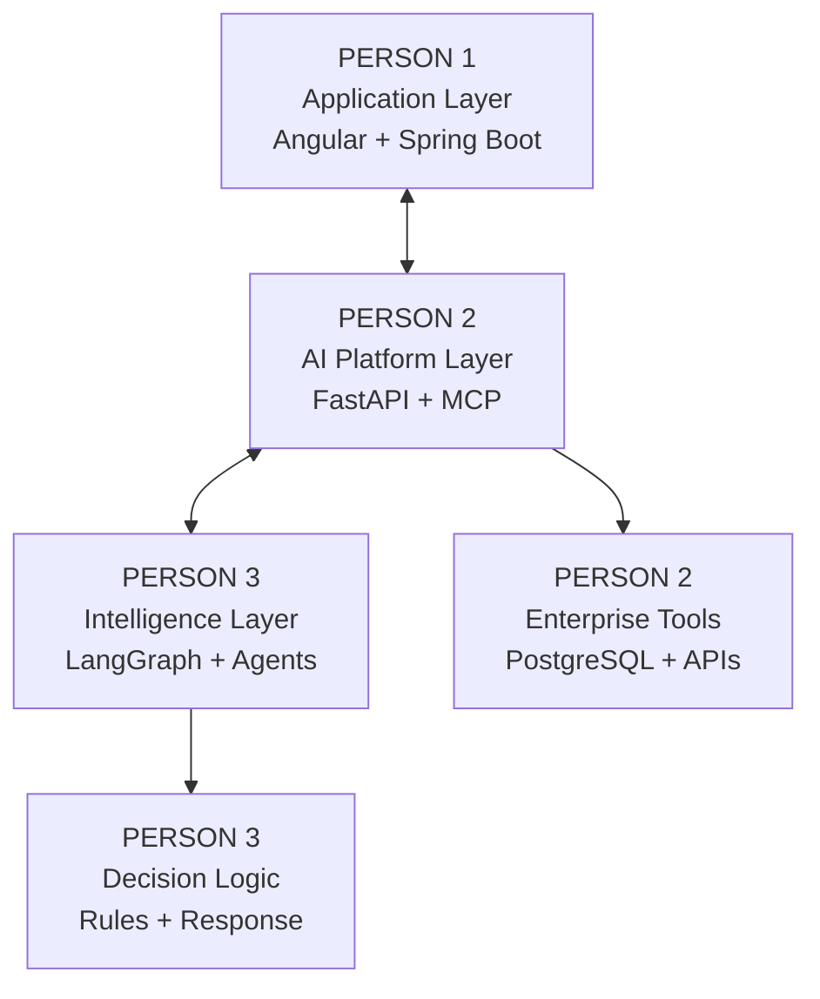
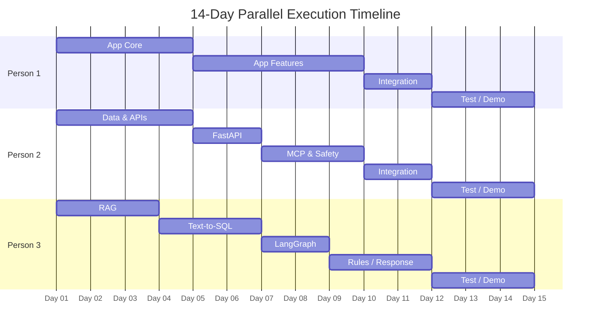

# BE Computer Science / AI & ML Final Year Project — Team Work Plan

## Supply Chain Intelligence Co-Pilot

*LangGraph • MCP • Knowledge Base RAG • Text-to-SQL • API Integration*

| | |
|---|---|
| **Team Size** | 3 members |
| **Execution Window** | 14 days |
| **Primary Deliverable** | Working end-to-end prototype |
| **Development Model** | Three coherent parallel ownership tracks |
| **Flagship Demo** | Order status + delay cause + SLA breach + recommended action |

*Prepared as a dependency-aware execution plan with task gates, handoffs, technologies and branch problem statements.*

---

## Contents

1. [Project Overview and Master Problem Statement](#1-project-overview-and-master-problem-statement)
2. [Team Ownership Model](#2-team-ownership-model)
3. [System Architecture and Request Flow](#3-system-architecture-and-request-flow)
4. [Person 1 Work Plan: Application Engineer](#4-person-1-work-plan-application-engineer)
5. [Person 2 Work Plan: AI Platform & Tooling Engineer](#5-person-2-work-plan-ai-platform--tooling-engineer)
6. [Person 3 Work Plan: AI Intelligence & Orchestration Engineer](#6-person-3-work-plan-ai-intelligence--orchestration-engineer)
7. [14-Day Master Timeline](#7-14-day-master-timeline)
8. [Cross-Team Handoffs and Completion Gates](#8-cross-team-handoffs-and-completion-gates)
9. [Integration, Testing and Demo Plan](#9-integration-testing-and-demo-plan)
10. [Final Deliverables and Definition of Done](#10-final-deliverables-and-definition-of-done)

---

## 1. Project Overview and Master Problem Statement

Supply chain teams often retrieve order, shipment, inventory, invoice, SLA and policy information from disconnected systems. The proposed co-pilot provides a single conversational interface that can search company documents, generate and execute safe SQL, call enterprise-style APIs, apply deterministic business rules and return a structured recommendation.

### Master Problem Statement

> Design and implement an agentic AI supply-chain co-pilot that understands natural-language business questions, selects the correct knowledge, database and API tools, combines the retrieved evidence, checks SLA and business rules, and returns an auditable answer with recommended actions.

### Flagship Demonstration Scenario

User asks: *"Where is customer order SO-45892? Why is it delayed and what action should we take?"*

1. Query order, invoice and inventory data.
2. Call the shipment-tracking API.
3. Retrieve relevant SLA and delay-handling SOP content.
4. Detect whether the promised delivery date has been breached.
5. Return the current status, cause, impact and recommended corrective action.

**End-to-End Request Flow**

---

## 2. Team Ownership Model

The project is split by architectural responsibility, not by random module count. Each member owns a coherent technical layer and has explicit interfaces with the other two members.

| Member | Role | Primary Ownership | Estimated Load | Core Question |
|---|---|---|---|---|
| Person 1 | Application Engineer | Angular, Spring Boot, auth, sessions, audit, response UI | ≈33% | How does the user securely interact with the system? |
| Person 2 | AI Platform & Tooling Engineer | FastAPI, PostgreSQL, mock APIs, MCP, tool safety | ≈33% | How does the AI access and execute against external systems? |
| Person 3 | AI Intelligence & Orchestration Engineer | RAG, Text-to-SQL, LangGraph, rules, final answer logic | ≈33% | How does the system understand, route, reason and decide? |

**Team Ownership and System Interaction**

*Clear ownership, explicit interfaces, shared integration.*

> **Boundary rule:** Person 2 owns FastAPI as the hosting and tool-execution platform. Person 3 owns AI reasoning. Person 1 owns presentation. End-to-end integration and testing are shared responsibilities.

---

## 3. System Architecture and Request Flow

*(See the End-to-End Request Flow diagram in Section 1 and the Team Ownership and System Interaction diagram in Section 2 — together these define the full architecture: Angular/Spring Boot on the presentation side, FastAPI/PostgreSQL/MCP on the platform side, and LangGraph/RAG/Text-to-SQL on the intelligence side.)*

---

## 4. Person 1 Work Plan: Application Engineer

### Branch Problem Statement

> Build a secure, usable and auditable application layer through which supply-chain users can submit natural-language questions, maintain sessions, view query history, inspect audit activity and receive structured AI results.

### Technology Stack

| Area | Technology | Purpose |
|---|---|---|
| Frontend | Angular, TypeScript, HTML, CSS | Chat UI, history, audit and result presentation |
| Application Backend | Java, Spring Boot | Application APIs and request routing |
| Security | Spring Security, JWT | Authentication and protected routes |
| Communication | REST, JSON, HTTP client | Angular ↔ Spring Boot ↔ FastAPI |
| Testing | Postman, browser testing, JUnit where useful | API and integration verification |
| Version Control | Git, dedicated application branch | Controlled delivery and merge discipline |

### Ordered Task Timeline

#### P1.1 Angular Project Foundation
**Deadline:** End of Day 1

Create the user-facing application skeleton.
- Create Angular project and routing.
- Create Login, Chat and Audit pages.
- Create basic layout and shared components.

**Completion gate:** Application runs and every page is reachable without backend dependency.
**Dependency / handoff:** No dependency. Output enables later UI development.

#### P1.2 Spring Boot Foundation
**Deadline:** End of Day 2

Create the application backend and freeze public API contracts.
- Create controller, service and DTO structure.
- Add exception handling and configuration.
- Define `/api/chat`, `/api/auth/login`, `/api/chat/history` and `/api/audit`.

**Completion gate:** Spring Boot runs; Angular successfully calls a test endpoint and receives JSON.
**Dependency / handoff:** Requires P1.1. API contracts must be shared with Persons 2 and 3.

#### P1.3 Complete Chat Interface
**Deadline:** End of Day 3

Build the complete chat interaction using mock data.
- User and assistant message components.
- Input, send action and loading state.
- Error state and structured result placeholders.

**Completion gate:** A hardcoded conversation works fully in the UI.
**Dependency / handoff:** Requires P1.1 and response schema from Person 3.

#### P1.4 Spring Boot Core APIs
**Deadline:** End of Day 4

Implement the application endpoints with temporary mock responses.
- Chat controller.
- History controller.
- Audit controller.
- Request and response models.

**Completion gate:** Angular → Spring Boot → Angular round trip works.
**Dependency / handoff:** Requires P1.2.

#### P1.5 Application Integration
**Deadline:** End of Day 5

Connect real Angular forms and components to Spring Boot.
- HTTP services.
- Request submission.
- Backend response rendering.
- Frontend error handling.

**Completion gate:** A user enters a question and receives a backend-generated response.
**Dependency / handoff:** Requires P1.3 and P1.4.

#### P1.6 Authentication and Sessions
**Deadline:** End of Day 6

Secure the application.
- Login flow.
- JWT handling.
- Protected routes.
- User session state.

**Completion gate:** Unauthenticated users are blocked; valid tokens are attached to protected requests.
**Dependency / handoff:** Requires stable Spring Boot APIs.

#### P1.7 Query History
**Deadline:** End of Day 7

Persist and display previous user queries.
- History API integration.
- Conversation list.
- Restore previous query details.

**Completion gate:** Previous queries remain available after refresh.
**Dependency / handoff:** Requires authentication and backend persistence.

#### P1.8 Audit View
**Deadline:** End of Day 8

Expose auditable system activity.
- Display user, query, timestamp, agents, tools and status.
- Add basic filtering if time permits.

**Completion gate:** Every test query has a visible audit record.
**Dependency / handoff:** Requires audit data contract from the integrated backend.

#### P1.9 Structured AI Response UI
**Deadline:** End of Day 9

Render the AI output as a decision-support interface.
- Order status.
- Shipment status.
- Delay reason and delay days.
- SLA warning.
- Recommended actions.
- Sources.

**Completion gate:** A complete structured mock response renders without manual parsing.
**Dependency / handoff:** Requires final response schema from Person 3.

#### P1.10 Final Application Integration
**Deadline:** End of Day 11

Replace mocks with the real AI pipeline.
- Connect Spring Boot to Person 2's FastAPI service.
- Handle real success and failure responses.
- Verify audit and history flow.

**Completion gate:** Angular → Spring Boot → FastAPI → AI → Spring Boot → Angular works.
**Dependency / handoff:** Requires Persons 2 and 3 to expose a stable integrated AI endpoint.

---

## 5. Person 2 Work Plan: AI Platform & Tooling Engineer

### Branch Problem Statement

> Build the platform through which the AI safely accesses structured enterprise data and operational services. The platform must expose a stable FastAPI interface, realistic PostgreSQL data, enterprise-style mock APIs, standardized MCP tools and safe execution controls.

### Technology Stack

| Area | Technology | Purpose |
|---|---|---|
| AI Service Host | Python, FastAPI, Pydantic, Uvicorn | Host AI endpoint and validate contracts |
| Database | PostgreSQL, SQL | Structured supply-chain data |
| ORM / DB Access | SQLAlchemy or psycopg | Database connectivity and execution |
| Enterprise Simulation | REST APIs, FastAPI routers | Shipment, ERP and inventory services |
| Tool Connectivity | MCP server/client | Standardized access to DB and APIs |
| Safety | SQL parser/validation, allowlists, timeouts | Safe tool execution |
| Testing | Postman, pytest | API, tool and failure-path verification |
| Version Control | Git, dedicated platform branch | Controlled delivery and merge discipline |

### Ordered Task Timeline

#### P2.1 Database Design
**Deadline:** End of Day 1

Freeze the relational model required by the project.
- Define `customers`, `sales_orders`, `order_items`, `inventory`, `warehouses`, `shipments`, `invoices`, `payments`, `carrier_tracking` and `audit_logs`.
- Define keys, relationships and status values.

**Completion gate:** Person 3 approves the schema for Text-to-SQL use.
**Dependency / handoff:** No dependency. Schema becomes a hard handoff to Person 3.

#### P2.2 PostgreSQL Implementation
**Deadline:** End of Day 2

Create the physical database.
- Create tables and constraints.
- Add useful indexes.
- Verify relationships and sample CRUD operations.

**Completion gate:** Every table can be queried successfully.
**Dependency / handoff:** Requires frozen schema.

#### P2.3 Realistic Dummy Data
**Deadline:** End of Day 3

Create enough data for meaningful AI demonstrations.
- Populate customers, orders, items, inventory, shipments, invoices and tracking events.
- Include on-time, shortage, customs hold, payment hold, carrier delay, warehouse delay and SLA breach scenarios.

**Completion gate:** At least 10 predefined business scenarios can be queried manually.
**Dependency / handoff:** Requires P2.2. Dataset and schema are handed to Person 3.

#### P2.4 Mock Enterprise APIs
**Deadline:** End of Day 4

Simulate external operational systems.
- Shipment status endpoint.
- Inventory endpoint.
- ERP order endpoint.
- Predictable JSON for demo cases.

**Completion gate:** All endpoints return correct responses for predefined scenarios.
**Dependency / handoff:** Requires stable dummy data.

#### P2.5 FastAPI AI Service
**Deadline:** End of Day 5

Create the hosting boundary for the AI layer.
- Create FastAPI application.
- Define request/response models.
- Add health endpoint.
- Add `POST /ai/query` endpoint with temporary response.

**Completion gate:** Spring Boot can send a question and receive valid JSON.
**Dependency / handoff:** Requires response contract from Person 3 and API contract from Person 1.

#### P2.6 Tool Access Layer
**Deadline:** End of Day 6

Connect the AI platform to the database and APIs.
- Database connection.
- HTTP clients for mock APIs.
- Standard error handling.

**Completion gate:** FastAPI can retrieve one order, one shipment and one inventory record.
**Dependency / handoff:** Requires P2.2 and P2.4.

#### P2.7 MCP Server and Database Tools
**Deadline:** End of Day 7

Expose standardized database access.
- Implement `query_database()`.
- Implement `get_order()`.
- Define structured tool outputs.

**Completion gate:** Person 3 can invoke both tools independently.
**Dependency / handoff:** Requires P2.6.

#### P2.8 MCP API Tools
**Deadline:** End of Day 8

Expose standardized operational API access.
- Implement `track_shipment()`.
- Implement `get_inventory()`.
- Implement `get_order_status()`.

**Completion gate:** All tools return consistent structured responses.
**Dependency / handoff:** Requires P2.4 and P2.7.

#### P2.9 Tool Safety and Reliability
**Deadline:** End of Day 9

Prevent unsafe or uncontrolled execution.
- SELECT-only enforcement.
- Table allowlist.
- Row limits.
- Query timeout.
- Tool error normalization.

**Completion gate:** Dangerous SQL is rejected and failed tools return controlled errors.
**Dependency / handoff:** Requires MCP database tools.

#### P2.10 Platform Integration
**Deadline:** End of Day 11

Connect FastAPI, LangGraph and MCP into one execution platform.
- Expose Person 3's workflow through FastAPI.
- Verify LangGraph can invoke all MCP tools.
- Stabilize service errors and response contracts.

**Completion gate:** FastAPI → LangGraph → MCP → Database/APIs works reliably.
**Dependency / handoff:** Requires Person 3's integrated LangGraph workflow.

---

## 6. Person 3 Work Plan: AI Intelligence & Orchestration Engineer

### Branch Problem Statement

> Build the intelligence layer that understands user intent, retrieves policy knowledge, converts business questions to SQL, orchestrates multi-step agent execution, applies deterministic SLA and escalation rules, and produces a structured evidence-backed final answer.

### Technology Stack

| Area | Technology | Purpose |
|---|---|---|
| Agent Orchestration | LangGraph | State, routing and multi-step workflows |
| LLM | Qwen / Llama / GPT-compatible model | Intent, SQL generation and response synthesis |
| Knowledge Retrieval | RAG pipeline | Retrieve SOP, SLA and policy evidence |
| Vector Store | ChromaDB or pgvector | Store and search document embeddings |
| Text-to-SQL | Prompting + schema context + validation | Generate SQL from business questions |
| Business Logic | Python deterministic rules | SLA breach, delay and escalation decisions |
| Evaluation | Curated test set and expected outputs | Measure routing, SQL and answer quality |
| Version Control | Git, dedicated intelligence branch | Controlled delivery and merge discipline |

### Ordered Task Timeline

#### P3.1 AI Architecture and Shared Contracts
**Deadline:** End of Day 1

Freeze the AI design before implementation begins.
- Define agent list.
- Define LangGraph state.
- Define intent types.
- Define tool requirements.
- Define final structured response schema.

**Completion gate:** Persons 1 and 2 approve the interfaces.
**Dependency / handoff:** No dependency. This is a critical cross-team contract.

#### P3.2 Knowledge Base Preparation
**Deadline:** End of Day 2

Prepare the enterprise knowledge required for RAG.
- Create or collect SLA policy, shipment delay SOP, customs hold SOP, inventory shortage SOP, escalation matrix and customer notification policy.

**Completion gate:** At least 10 useful documents are ready for ingestion.
**Dependency / handoff:** Requires project use cases to be frozen.

#### P3.3 RAG Ingestion Pipeline
**Deadline:** End of Day 3

Index the knowledge base.
- Parse documents.
- Chunk content.
- Generate embeddings.
- Store vectors with source metadata.

**Completion gate:** All documents are indexed and retrievable.
**Dependency / handoff:** Requires P3.2.

#### P3.4 Knowledge Base Agent
**Deadline:** End of Day 4

Retrieve relevant policy evidence and preserve sources.
- Semantic retrieval.
- Context assembly.
- Source metadata.
- Knowledge answer generation.

**Completion gate:** At least 10 policy questions return relevant answers and sources.
**Dependency / handoff:** Requires P3.3.

#### P3.5 Text-to-SQL Agent
**Deadline:** End of Day 5

Convert business questions into SQL using the frozen schema.
- Schema-aware prompting.
- Relevant table selection.
- SQL generation.
- Logical validation before tool execution.

**Completion gate:** Basic filters, joins and aggregations generate correct SQL.
**Dependency / handoff:** Requires Person 2's frozen schema and sample data.

#### P3.6 Text-to-SQL Evaluation
**Deadline:** End of Day 6

Measure and improve SQL generation quality.
- Test filtering, aggregation, joins, dates, warehouse and delay queries.
- Fix prompts and schema context.

**Completion gate:** At least 15 of 20 predefined questions generate correct SQL.
**Dependency / handoff:** Requires P3.5 and Person 2's database.

#### P3.7 Intent Classification
**Deadline:** End of Day 7

Route each question to the correct execution path.
- Support `KNOWLEDGE_QUERY`, `DATABASE_QUERY`, `API_QUERY` and `MULTI_TOOL_QUERY`.
- Create a test set.

**Completion gate:** At least 18 of 20 test questions route correctly.
**Dependency / handoff:** Requires working RAG and Text-to-SQL paths.

#### P3.8 LangGraph Supervisor
**Deadline:** End of Day 8

Create stateful agent orchestration.
- Create graph state.
- Add supervisor and conditional routing.
- Add Knowledge, SQL and API paths.

**Completion gate:** Knowledge, database and API questions each reach the correct path.
**Dependency / handoff:** Requires P3.4, P3.6, P3.7 and Person 2's MCP tools.

#### P3.9 Multi-Agent Integration
**Deadline:** End of Day 9

Combine evidence from multiple systems.
- Query order data.
- Call shipment API.
- Retrieve relevant knowledge.
- Combine results in graph state.

**Completion gate:** One flagship question successfully gathers data from all required sources.
**Dependency / handoff:** Requires P3.8 and Person 2's stable tools.

#### P3.10 Business Rule Agent
**Deadline:** End of Day 10

Apply deterministic operational decisions.
- SLA breach detection.
- Delay calculation.
- Escalation level.
- Corrective action selection.

**Completion gate:** Known scenarios produce expected deterministic outcomes.
**Dependency / handoff:** Requires integrated data from P3.9.

#### P3.11 Final Response Logic
**Deadline:** End of Day 11

Return a stable structured answer for the application layer.
- Return order status, shipment status, delay reason, delay days, SLA status, recommended actions and sources.
- Add retry/fallback handling for failed agent paths.

**Completion gate:** Person 1 can render the response without parsing free-form prose.
**Dependency / handoff:** Requires P3.10 and Person 2's FastAPI integration.

---

## 7. 14-Day Master Timeline

**14-Day Parallel Execution Timeline**

*Project Day axis runs 1 → 14. Phase lengths above approximate the original diagram; exact task-level deadlines are given in the table below and in Sections 4–6.*

### Day-by-Day Breakdown

| Day | Person 1 | Person 2 | Person 3 |
|---|---|---|---|
| 1 | Angular foundation | Database design | AI architecture + contracts |
| 2 | Spring Boot foundation | PostgreSQL implementation | Knowledge base preparation |
| 3 | Complete chat UI | Realistic dummy data | RAG ingestion |
| 4 | Spring Boot core APIs | Mock enterprise APIs | Knowledge Base Agent |
| 5 | Angular ↔ Spring Boot | FastAPI AI service | Text-to-SQL agent |
| 6 | Authentication + sessions | Tool access layer | Text-to-SQL evaluation |
| 7 | Query history | MCP DB tools | Intent classification |
| 8 | Audit view | MCP API tools | LangGraph supervisor |
| 9 | Structured AI response UI | Tool safety | Multi-agent integration |
| 10 | Integration preparation | Platform stabilization | Business Rule Agent |
| 11 | Final app integration | Platform integration | Final response logic |
| 12 | System integration | System integration | System integration |
| 13 | Testing + bug fixing | Testing + bug fixing | Evaluation + bug fixing |
| 14 | Demo + documentation | Demo + documentation | Demo + documentation |

---

## 8. Cross-Team Handoffs and Completion Gates

| Deadline | Owner | Handoff | Receiver | Gate |
|---|---|---|---|---|
| Day 1 | P2 | Frozen DB schema | P3 | Text-to-SQL can begin |
| Day 1 | P3 | Response schema + tool requirements | P1, P2 | UI and FastAPI contracts can stabilize |
| Day 4 | P2 | Database + sample data + mock APIs | P3 | AI agents have real test targets |
| Day 5 | P2 | Working `/ai/query` endpoint | P1 | Full app skeleton can connect |
| Day 7–8 | P2 | MCP tools | P3 | LangGraph can call real tools |
| Day 9 | P3 | Integrated multi-agent flow | P2 | FastAPI integration can stabilize |
| Day 11 | P3 | Final structured response | P1 | Final UI integration can freeze |
| Day 11 | All | End-to-end flagship flow | All | Feature freeze |

### Non-Negotiable Milestones

- End of Day 1: Architecture, database schema, API contracts and response schema are frozen.
- End of Day 6: Angular → Spring Boot → FastAPI works; database, APIs, RAG and Text-to-SQL work independently.
- End of Day 9: MCP tools and LangGraph routing work; the flagship question can gather multi-source evidence.
- End of Day 11: Complete end-to-end flow works. Feature freeze begins.
- Days 12–13: Only integration, testing, evaluation and bug fixing.
- Day 14: Demo, report, presentation and final packaging.

---

## 9. Integration, Testing and Demo Plan

### Feature Freeze Rule

> After Day 11, no new features are allowed unless they fix a critical gap in the flagship demo. Days 12–14 are for reliability, evaluation, documentation and presentation.

### Required Test Categories

- **Application tests:** login, protected routes, chat submission, loading, errors, history and audit.
- **Platform tests:** database connectivity, API responses, MCP tool calls, timeouts and controlled failures.
- **AI tests:** RAG relevance, source correctness, Text-to-SQL accuracy, intent routing and multi-agent execution.
- **Business-rule tests:** SLA breach, delay days, escalation and recommended action consistency.
- **End-to-end tests:** at least five complete scenarios, including the flagship order SO-45892 case.

### Flagship Demo Acceptance Flow

1. User logs in and asks the flagship order-delay question.
2. Application sends the request through Spring Boot to FastAPI.
3. LangGraph classifies the query as multi-tool.
4. Text-to-SQL retrieves order data through the MCP database tool.
5. Shipment API tool returns the current operational status.
6. Knowledge Base Agent retrieves SLA and customs-delay guidance.
7. Business Rule Agent detects delay and SLA breach.
8. Final structured answer is returned with recommended actions and sources.
9. Application renders the result and audit trail.

---

## 10. Final Deliverables and Definition of Done

| Deliverable | Primary Owner | Definition of Done |
|---|---|---|
| Angular application | P1 | Chat, login, history, audit and structured response UI work |
| Spring Boot backend | P1 | Auth, sessions, application APIs and routing work |
| PostgreSQL database | P2 | Schema, realistic data and stable queries work |
| Mock enterprise APIs | P2 | Shipment, ERP and inventory scenarios work |
| FastAPI AI service | P2 | Stable AI endpoint hosts the integrated workflow |
| MCP tools | P2 | Database and API tools are callable and safe |
| Knowledge Base RAG | P3 | Relevant evidence and source metadata are retrieved |
| Text-to-SQL | P3 | Meets agreed evaluation threshold |
| LangGraph workflow | P3 | Routes and executes single/multi-tool queries |
| Business rules | P3 | SLA, delay and escalation outcomes are deterministic |
| System integration | All | Flagship and backup scenarios run end-to-end |
| Report, PPT, demo video | All | Architecture, ownership, results and limitations are documented |

### Final Team Operating Rules

- No person moves to the next task until the current task passes its completion gate.
- Shared contracts may not be changed silently. Schema or API changes require immediate team agreement.
- Each person maintains their own branch and merges only tested work.
- Every evening, the team runs a 15-minute handoff review: completed, blocked, required from others.
- The flagship demo scenario is tested continuously from Day 9 onward.
- After Day 11, reliability outranks feature count.

---

**END OF WORK PLAN**
