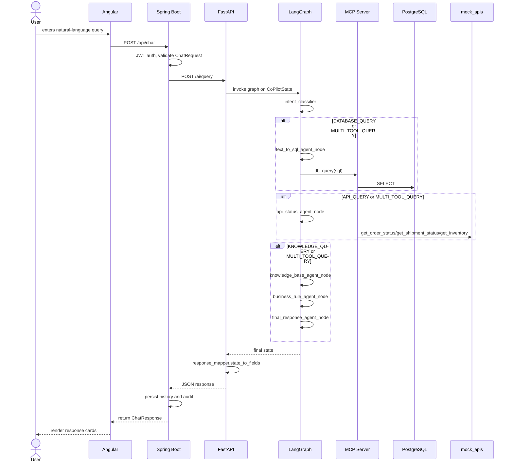
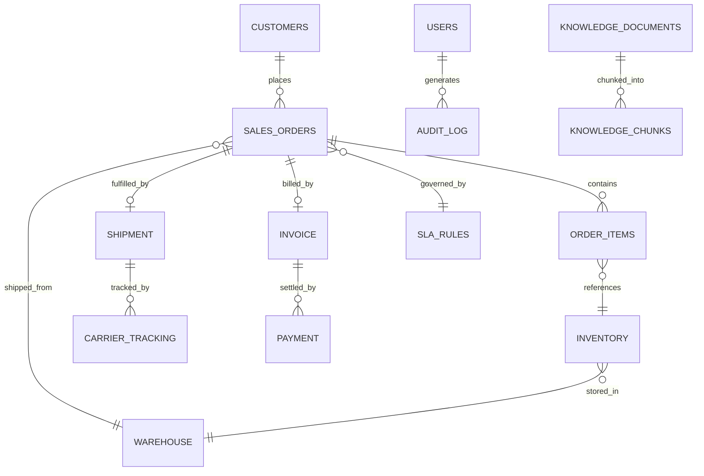

# NexChain Technical Reference

> This document captures the implemented architecture, code structure, execution flows, security, Docker configuration, AI system, and testing for the NexChain Supply Chain Intelligence Co-Pilot.

---

## 1. PROJECT OVERVIEW

### Problem Statement
NexChain solves the fragmentation of supply chain data across ERP, WMS, TMS, carrier tracking, and policy documents. The system enables conversational inquiry over this data and returns structured, deterministic answers rather than open-ended LLM prose.

### Business Objective
- Enable supply chain professionals to ask natural-language questions about orders, shipments, inventory, and policy.
- Reduce operator effort by surfacing SLA breach status, delay reasons, recommended actions, and source citations.
- Capture an audit trail of every request, intent, and decision.
- Support admin review of history and audit records.

### Target Users
- Supply Chain Manager
- Customer Service Representative
- Operations/Warehouse Analyst
- Admin / IT Auditor

### Architecture Overview
The implemented architecture is a 6-service stack:
- `frontend/`: Angular 21 SPA on port 4200
- `backend-api/`: Spring Boot 3.5 app on port 8080
- `ai_service/`: FastAPI wrapper around LangGraph on port 8001
- `ai/`: LangGraph graph, agent code, RAG, and MCP client
- `mcp_server/`: MCP tool server on port 8002
- `mock_apis/`: simulated ERP/WMS/TMS APIs on port 8000
- PostgreSQL 15 database on port 5432

### Tech Stack
- Frontend: Angular 21, standalone components, Angular Signals, template-driven forms
- Backend: Spring Boot, Java 25, Spring Security, JJWT, H2 embedded file-backed store
- AI service: FastAPI, Pydantic, LangGraph, Gemini LLM, sentence-transformers, ChromaDB
- Tooling: Model Context Protocol (MCP) streamable-http client/server
- Database: PostgreSQL 15, SQL scripts for schema and roles
- DevOps: Docker Compose, GitHub Actions CI, Dependabot

### Why Each Technology
- Angular: single-page frontend with client routing, forms, and auth
- Spring Boot: standardized Java web API with security and DTO handling
- FastAPI: lightweight HTTP host for the AI pipeline, easy error mapping
- LangGraph: multi-agent orchestration and branching logic
- ChromaDB: embedded retrieval store for RAG, no external vector service dependency
- MCP: real tool invocation protocol for separation of agent and tool boundaries
- PostgreSQL: normalized supply chain schema, read-write support for seeded data

### High-level Request Lifecycle
1. Browser sends request from Angular to Spring Boot `/api/chat`
2. Spring Boot authenticates via JWT (or rejects)
3. Spring Boot forwards the query to FastAPI `/ai/query`
4. FastAPI initializes `CoPilotState` and invokes `ai/graph/build_graph`
5. LangGraph runs `intent_classifier`, then any required agent nodes
6. Text-to-SQL agent may call MCP `db_query`
7. API status agent may call MCP `get_order_status`, `get_shipment_status`, or `get_inventory`
8. Knowledge base agent may run semantic retrieval over `ai/knowledge_base`
9. Business rule agent evaluates SLA and corrective actions
10. Final response agent assembles prose and state
11. FastAPI maps internal state to `CoPilotResponse`
12. Spring Boot persists history and audit log
13. Angular renders structured cards

### Capabilities and Limitations
Capabilities:
- Natural-language order, shipment, inventory, policy, and delay questions
- Structured `CoPilotResponse` with SLA, status, actions, and sources
- RAG-based SOP citations
- Business-rule driven SLA verdicts
- Audit and history recording

Limitations:
- No second LLM provider fallback; Gemini-only
- Knowledge base retrieval uses local ChromaDB only, not MCP tool
- Mock APIs are simulated and read from seeded Postgres
- `kb_search` MCP tool is intentionally unimplemented; KB access uses direct retrieval
- Users are backed by `InMemoryUserStore` rather than real DB auth

### Future Scope
- Replace demo in-memory auth with PostgreSQL-backed user management
- Add full `kb_search` MCP tool and possible external vendor fallbacks
- Add production-grade secrets management and vault integration
- Expand audit log filters and pagination in Angular
- Add real external API integration in place of mock_apis
- Introduce additional campaign / project-specific policy documents

---

## 2. FOLDER STRUCTURE

### Root repository
- `README.md`: repo description and quick start
- `PRODUCT.md`: product and persona definitions
- `info.md`: this technical reference
- `docs/`: supplementary architecture, schema, and requirements documents
- `infra/`: Docker Compose and environment guidance
- `db/`: migration scripts, schema DDL, seed data, verification SQL

### `frontend/`
Purpose: Angular SPA and UI assets.
Key files:
- `src/app/app.routes.ts`: route configuration
- `src/app/core/guards/auth.guard.ts`: authentication guard
- `src/app/core/guards/admin.guard.ts`: admin-only guard
- `src/app/core/interceptors/auth.interceptor.ts`: attaches JWT to requests
- `src/app/features/chat/services/chat-api.service.ts`: chat API transport
- `src/app/features/auth/services/login-api.service.ts`: login transport
- `src/app/features/history/services/history-api.service.ts`: history retrieval
- `src/app/features/audit/services/audit-api.service.ts`: audit log retrieval
- `src/app/features/chat/pages/chat-page/chat-page.component.ts`: chat UX
- `src/app/features/history/pages/history-page/history-page.component.ts`
- `src/app/features/audit/pages/audit-page/audit-page.component.ts`

### `backend-api/`
Purpose: Spring Boot backend for auth, AI proxy, history, audit.
Key files:
- `src/main/java/com/nexchain/backend/BackendApiApplication.java`
- `src/main/java/com/nexchain/backend/auth/controller/AuthController.java`
- `src/main/java/com/nexchain/backend/chat/controller/ChatController.java`
- `src/main/java/com/nexchain/backend/history/controller/HistoryController.java`
- `src/main/java/com/nexchain/backend/audit/controller/AuditController.java`
- `src/main/java/com/nexchain/backend/chat/service/ChatService.java`
- `src/main/java/com/nexchain/backend/chat/client/RestClientAiQueryClient.java`
- `src/main/resources/application.yml`

### `ai/`
Purpose: LangGraph multi-agent pipeline, intent classification, text-to-SQL, KB, rules, and vector ingestion.
Key files:
- `contracts.py`: shared frozen AI contracts
- `graph/graph.py`: graph assembly and node wiring
- `graph/nodes.py`: node implementations for each agent
- `graph/supervisor.py`: top-level supervision
- `agents/intent_classifier/classifier.py`: intent classification logic
- `agents/text_to_sql_agent/agent.py`: SQL generation orchestration
- `agents/text_to_sql_agent/validator.py`: SQL validation logic
- `agents/knowledge_base_agent/agent.py`: KB answer generation
- `agents/business_rule_agent/rules.py`: business rules engine
- `rag/`: vector storage, ingestion, chunking
- `mcp_client.py`: actual MCP client using streamable HTTP

### `ai_service/`
Purpose: FastAPI HTTP boundary for the AI graph.
Key files:
- `main.py`: FastAPI app and request lifecycle
- `schemas.py`: Pydantic request/response models
- `response_mapper.py`: maps `CoPilotState` to `CoPilotResponse`
- `tools/`: API client, DB client, errors

### `mcp_server/`
Purpose: MCP tool server exposing real tools.
Key files:
- `server.py`: tool definitions and FastMCP server
- `test_server.py`: MCP tool tests

### `mock_apis/`
Purpose: simulate external enterprise APIs.
Key files:
- `main.py`: FastAPI endpoints for `/api/order`, `/api/shipment/status`, `/api/inventory`
- `db.py`: database fetch logic for mocks
- `test_mock_apis.py`: tests for mock endpoints

### `db/`
Purpose: PostgreSQL migrations, seed data, and verification.
Key files:
- `migrations/001_init_schema.sql`: full schema DDL for 14 tables
- `migrations/002_roles.sh`: role creation for `copilot_readonly` and `copilot_app`
- `seed_data.sql`: seeded warehouse, customer, order, shipment, inventory data
- `verify_*.sql`: validation queries

### `infra/`
Purpose: container orchestration and environment variables.
Key files:
- `docker-compose.yml`: service definitions and startup order
- `.env.example`: environment variable template
- `nginx.conf` (frontend static hosting, if present)

---

## 3. EVERY FILE

This repository contains 450+ source files across the folders above. The major file responsibilities are:

### `frontend/`
- `app.routes.ts`: defines routes for `login`, `chat`, `history`, `audit` and guards.
- `auth.guard.ts` / `admin.guard.ts`: protect authenticated pages and admin-only pages.
- `chat-api.service.ts`: posts chat queries to Spring Boot and maps backend errors to friendly messages.
- `login-api.service.ts`: posts credentials to `/api/auth/login`.
- Component files under `features/`: implement pages and UI behavior.
- `shared/components/response-cards/*`: render the structured response fields from AI answers.

### `backend-api/`
- `AuthController.java`: login endpoint.
- `ChatController.java`: chat endpoint, history and audit persistence side effects.
- `HistoryController.java`: history list/detail/delete endpoints.
- `AuditController.java`: admin-only audit endpoint.
- `ChatService.java`: forwards queries to AI service, wraps result in `ChatResponse`.
- `RestClientAiQueryClient.java`: HTTP client to FastAPI, handles non-2xx responses and timeouts.
- `JwtService.java`, `JwtAuthenticationFilter.java`: JWT creation/validation.
- `SecurityConfig.java`: CORS, stateless JWT security, role restrictions.
- `InMemoryUserStore.java`: seeded demo user directory with bcrypt-hashed passwords.
- `application.yml`: H2 history storage, AI service base URL, timeout and JWT config.

### `ai/`
- `contracts.py`: frozen shared models and MCP tool stubs.
- `graph/graph.py`: compiles the LangGraph state machine.
- `graph/nodes.py`: node functions for knowledge, SQL, API, business rules, final response.
- `agents/text_to_sql_agent/validator.py`: enforces SQL allowlist, denied keywords, and row cap.
- `agents/business_rule_agent/rules.py`: deterministic SLA and escalation logic.
- `rag/loader.py`, `chunker.py`, `embedder.py`, `vector_store.py`: ingest and query knowledge base documents.

### `ai_service/`
- `main.py`: FastAPI app with exception handlers for validation, `ToolError`, and timeouts.
- `schemas.py`: request/response models with camelCase wire aliases.
- `response_mapper.py`: converts agent state into the wire fields for Spring Boot.
- `tools/api_client.py` and `tools/db.py`: common HTTP and database utilities used by tools and MCP.
- `tools/errors.py`: `ToolError` hierarchy for consistent error semantics.

### `mcp_server/`
- `server.py`: implements `db_query`, `get_order`, `get_order_status`, `get_shipment_status`, and `get_inventory` tools via `FastMCP`.
- connection and transport security settings for streamable HTTP.
- `test_server.py`: verifies tool behavior.

### `mock_apis/`
- `main.py`: FastAPI endpoints that return `OrderStatus`, `ShipmentStatus`, and `InventoryRecord` from seeded Postgres.
- `db.py`: shared database connection helpers.

### `db/`
- `migrations/001_init_schema.sql`: schema for 14 tables including `customers`, `sales_orders`, `shipment`, `payment`, `knowledge_documents`, `audit_log`.
- `migrations/002_roles.sh`: creates Postgres roles `copilot_readonly` and `copilot_app`.
- `seed_data.sql`: demo datasets including the flagship `SO-45892` scenario.

### `infra/`
- `docker-compose.yml`: orchestrates service dependencies and required startup health checks.
- `.env.example`: declares required secrets and service URLs.

> Note: `ai/chroma_db/` contains the persisted ChromaDB vector index used by the knowledge base.

---

## 4. COMPLETE EXECUTION FLOW

### Sequence from Browser to Response

### Detailed Flow
- `frontend/src/app/features/chat/services/chat-api.service.ts`: sends the request to Spring Boot.
- `backend-api/src/main/java/com/nexchain/backend/chat/controller/ChatController.java`: receives `/api/chat` and validates `ChatRequest`.
- `ChatService.getResponse()`: mints `traceId`, passes query, sessionId, username to `AiQueryClient`.
- `RestClientAiQueryClient.query()`: sends `AiServiceRequest` to `POST /ai/query` and converts `AiServiceResponse` to `AiQueryResult`.
- `ai_service/main.py`: constructs `CoPilotState` and submits `_graph.invoke()` to a thread pool.
- `ai/graph/graph.py`: builds the `StateGraph` with edges from `intent_classifier` to conditional branch nodes, then business rule, final response, end.
- `ai/graph/nodes.py`: each node executes a business step, calls tool boundaries, and updates state.
- `ai_service/response_mapper.py`: maps `rule_result`, `api_result`, `kb_result`, `sql_result` into wire fields.
- `ChatController` persists `history` via `HistoryService.record()` and `audit` via `AuditService.record()` if those succeed.
- Angular renders the structured response from `ChatResponse`.

---

## 5. FRONTEND

### Pages and Routing
- `frontend/src/app/app.routes.ts`: main route configuration.
  - `/login`: `LoginPageComponent`
  - `/chat`: `ChatPageComponent` behind `authGuard`
  - `/history`: `HistoryPageComponent` behind `authGuard`
  - `/audit`: `AuditPageComponent` behind `authGuard` and `adminGuard`

### Guards
- `authGuard`: redirects unauthenticated users to `/login`.
- `adminGuard`: redirects authenticated non-admin users from `/audit` to `/chat`.

### Services
- `ChatApiService`: calls Spring Boot `/api/chat` and normalizes backend errors.
- `LoginApiService`: calls `/api/auth/login` and stores JWT and user details.
- `HistoryApiService`: retrieves user history from `/api/chat/history`.
- `AuditApiService`: retrieves admin audit data from `/api/audit`.
- `AuthService`: manages JWT in local storage and current user state.

### Models
- `ChatResponse`: interface matching `backend-api` wire contract.
- `HistoryItemDto`, `AuditEntryDto`: typed shapes for history and audit list responses.

### State Management
- Angular Signals and component-local state are used instead of NgRx.
- `AuthService` tracks authentication status and user role.

### Forms and Validation
- Login page uses template-driven form validation for required `email` and `password`.
- `ChatPageComponent` includes message input and suggested questions; invalid empty queries are prevented client-side.

### HTTP Calls and Interceptors
- `auth.interceptor.ts` attaches `Authorization: Bearer <token>` to requests.
- `ChatApiService.sendMessage()` handles network and backend validation errors.

### Error Handling
- UI surfaces backend validation errors directly when available.
- A generic friendly message is used for network or server failures.
- `AdminGuard` prevents unauthorized navigation before the server rejects.

---

## 6. BACKEND

### Spring Boot Architecture
- `backend-api/src/main/java/com/nexchain/backend/BackendApiApplication.java`: Spring Boot entry point.
- Controllers: `AuthController`, `ChatController`, `HistoryController`, `AuditController`.
- Services: `AuthService`, `ChatService`, `HistoryService`, `AuditService`.
- Security: JWT + role-based access + CORS.
- Persistence: H2 file-backed DB for conversation history.

### Controllers
- `AuthController.login()`: authenticates email/password.
- `ChatController.chat()`: handles `/api/chat`, invokes AI, and records side effects.
- `HistoryController`: exposes `/api/chat/history` and `/api/chat/history/{id}`.
- `AuditController`: admin-only `/api/audit`.

### Services
- `ChatService`: creates trace/session IDs and wraps AI query results into domain response.
- `HistoryService`: records and retrieves conversation history via `ConversationHistoryStore`.
- `AuditService`: records audit entries from `ChatResponse`.

### Repositories and Stores
- `ConversationHistoryStore`: persists chat history to H2.
- `AuditRepository`: stores audit entries via JPA converters.

### DTOs and Entities
- `ChatRequest`, `ChatResponse`: request/response contract for chat.
- `LoginRequest`, `LoginResponse`, `UserSummary`: auth DTOs.
- `SourceDto`, `SlaStatus`: shared DTO types.
- `AuditEntity`: audit logging entity storing JSON fields.
- `ConversationEntity`: history persistence entity.

### Configuration
- `Application.yml`: H2 datasource, AI service configuration, JWT secret, CORS allowed origins.
- `CorsConfig`: allows `http://localhost:4200` only for `/api/**`.
- `SecurityConfig`: stateless JWT auth, disables CSRF, configures role restrictions.
- `AiServiceConfig`: binds AI service URL and timeouts from properties.

### Exception Handling
- `GlobalExceptionHandler`: maps validation and runtime exceptions to proper HTTP responses.
- `RestAuthenticationEntryPoint` / `RestAccessDeniedHandler`: handle auth failures cleanly.

### Validation
- `ChatRequest`: bean validation for `query` required and max length 4000.
- `PaginationValidator`: validates history paging parameters.

### Business Rules and Logging
- Business rule logic is not implemented in Java; the backend forwards to AI service and persists the resulting structured answer.
- Business rule decisions are part of the AI pipeline.
- Logging is used in `ChatController` and `ChatService` to record failures in history/audit persistence and AI transport.

### Dependency Injection
- Beans are constructed via constructor injection throughout controllers and services.
- `SecurityConfig` exposes `PasswordEncoder` and `AuthenticationManager` beans.

---

## 7. DATABASE

### Schema Overview
The core PostgreSQL schema is defined in `db/migrations/001_init_schema.sql` and includes 14 tables:
- `customers`
- `warehouse`
- `sales_orders`
- `order_items`
- `inventory`
- `shipment`
- `carrier_tracking`
- `invoice`
- `payment`
- `sla_rules`
- `knowledge_documents`
- `knowledge_chunks`
- `users`
- `audit_log`

### Table Purposes
- `customers`: customer master data and SLA tier.
- `warehouse`: warehouse master records.
- `sales_orders`: order header data, promised/revised delivery, status.
- `order_items`: line items for sales orders.
- `inventory`: stock and reservation status per SKU and warehouse.
- `shipment`: shipment metadata and delay reason.
- `carrier_tracking`: event timeline for shipment tracking.
- `invoice`: invoicing data tied to orders.
- `payment`: payment records for invoices.
- `sla_rules`: tier-specific breach thresholds and escalation roles.
- `knowledge_documents`: metadata for KB documents.
- `knowledge_chunks`: text chunks for retrieval.
- `users`: user accounts for auth (schema present, but Spring Boot currently uses InMemoryUserStore).
- `audit_log`: structured audit trail for every chat request.

### Relationships
- `customers` -> `sales_orders`
- `warehouse` -> `sales_orders`
- `sales_orders` -> `order_items`, `invoice`, `shipment`
- `order_items` -> `inventory`
- `shipment` -> `carrier_tracking`
- `invoice` -> `payment`
- `knowledge_documents` -> `knowledge_chunks`
- `users` -> `audit_log`

### Primary Keys and Indexes
- Serial primary keys on every table.
- Indexes on key lookup columns like `sales_orders.order_no`, `shipment.tracking_no`, `inventory.sku`, `invoice.order_id`, and `audit_log.user_id`.

### Roles and Access
- `db/migrations/002_roles.sh` creates two DB roles:
  - `copilot_readonly`: SELECT-only on 12 business tables, statement timeout 5s, cannot access `users` or `audit_log`.
  - `copilot_app`: access to `audit_log` and `users`.

### Typical Queries
- `db_query` tool executes validated arbitrary SELECTs across allowed tables.
- `get_order` tool fetches order status, promised and revised dates, SLA tier, and warehouse.
- `mock_apis/main.py` uses SELECT statements against `sales_orders`, `shipment`, or `inventory` for external API simulations.
- The AI pipeline may query `sales_orders` and `shipment` indirectly through `db_query` or `get_order`.

### Data Lifecycle
- Seed data is loaded via `db/seed_data.sql` once after startup.
- `mock_apis` and `mcp_server` read from Postgres but do not write.
- Spring Boot `backend-api` uses H2 for history, not PostgreSQL.

### ER Diagram

---

## 8. AI SYSTEM

### AI Architecture
The AI system is an independent FastAPI app wrapping a LangGraph pipeline.
- `ai_service/main.py`: HTTP boundary and host for `/ai/query`.
- `ai/graph/build_graph()`: constructs the state graph from 7 nodes.
- `ai/graph/nodes.py`: agent logic implementations.
- `ai/contracts.py`: shared state and wire model contracts.
- `ai/mcp_client.py`: real MCP client for tool calls.
- `ai/agents/`: agent-specific code.
- `ai/rag/`: retrieval augmentation and embeddings.

### Routing and Intent Detection
- `ai/agents/intent_classifier/classifier.py`: maps raw queries to `BusinessIntent` values.
- `ai/contracts.py` defines `BusinessIntent` and `RoutingCategory`.
- `ai/graph/routing.py`: decides branch nodes after the supervisor.
- `INTENT_TO_ROUTING` maps intents to categories: `KNOWLEDGE_QUERY`, `DATABASE_QUERY`, `API_QUERY`, `MULTI_TOOL_QUERY`.

### Prompt Construction and Context
- `ai/agents/text_to_sql_agent/prompts.py`: constructs prompts for SQL generation.
- `ai/agents/knowledge_base_agent/prompts.py`: constructs KB retrieval prompts.
- `ai/agents/intent_classifier/prompts.py`: constructs classification prompts.
- `ai/agents/business_rule_agent/rules.py`: deterministic rules are not prompt-based.

### Context Generation
- For RAG, `ai/rag/loader.py` and `ai/rag/embedder.py` prepare document embeddings.
- `ai/rag/vector_store.py` stores and queries semantic vectors.
- Knowledge base documents are in `ai/knowledge_base/`.

### Tool Calling
- `ai/graph/api_boundary.py`: MCP boundary for `get_shipment_status`.
- `ai/agents/text_to_sql_agent/db_boundary.py`: MCP boundary for `db_query`, `get_order`, `resolve_tracking_no`.
- `ai/mcp_client.py`: actual client that opens a long-lived streamable HTTP MCP session.
- `mcp_server/server.py`: tool implementations.

### Structured Outputs
- Internal state is `CoPilotState` in `ai/contracts.py`.
- Final wire fields are generated in `ai_service/response_mapper.py`.
- Spring Boot maps `AiServiceResponse` to `ChatResponse`.

### Fallback Strategy and Error Handling
- `call_with_retry` in `ai/graph/retry.py` retries each LangGraph node once.
- Each graph node degrades in place: failures are stored in `kb_result`, `sql_result`, `api_result`, or `rule_result` rather than crashing the whole pipeline.
- `ai_service/main.py` maps `ToolError` to a clean 503 and unhandled exceptions to a generic 500, so the backend can degrade gracefully.

## 9. AI GRAPH DETAILS

### Graph structure
- `ai/graph/graph.py` builds the LangGraph pipeline with 7 nodes:
  - `intent_classifier`
  - `knowledge_base_agent`
  - `text_to_sql_agent`
  - `api_status_agent`
  - `business_rule_agent`
  - `final_response_agent`
  - `error_handler`
- Conditional routing is implemented with `StateGraph.add_conditional_edges()`.
- The supervisor node chooses the first branch; `next_pending_node()` sequences MULTI_TOOL_QUERY branches.

### Branch sequencing
- `ai/graph/routing.py` maps `BusinessIntent` to `RoutingCategory` with `INTENT_TO_ROUTING`.
- `MULTI_TOOL_QUERY` routes through required branches one after another, not in parallel, because `CoPilotState` is a plain TypedDict and cannot safely accept concurrent merges for retry counters.
- The graph always reaches `business_rule_agent` after branch nodes complete, or `error_handler` if the intent cannot be resolved.

### Retry policy
- `MAX_RETRIES_PER_NODE = 1` in `ai/contracts.py`.
- `ai/graph/retry.py` treats LLM outages, `ToolError`, and `LLMConfigError` as retryable by default, except when a tool returns a permanent rejection or a missing-record error.
- If a node exhausts retries, it records an error in its own result field and the graph continues to final response assembly.

## 10. MCP TOOL SERVER

### Purpose
- `mcp_server/server.py` implements the real tool boundary for the AI layer.
- The AI agents call these tools via MCP, not by importing database or HTTP clients directly.

### Tools provided
- `db_query(sql)`: validated SELECT execution with allowlist, denied-keywords, and row-limit enforcement.
- `get_order(order_no)`: authoritative order metadata including SLA tier and warehouse.
- `get_order_status(order_no)`: ERP order status from the mock ERP API.
- `get_shipment_status(tracking_no)`: carrier shipment status from the mock shipment API.
- `get_inventory(sku)`: inventory availability from the mock inventory API.
- `kb_search`: intentionally unimplemented; the system currently uses direct KB retrieval instead.

### Defense in depth
- `db_query` validates SQL again at the tool boundary using `ai.agents.text_to_sql_agent.validator.validate_sql()`.
- The tool layer logs every call, including inputs, success/failure, latency, and size.
- `TransportSecuritySettings` enforces allowed hosts and origins to avoid DNS rebinding attacks.

## 11. MOCK APIS

### Simulated enterprise systems
- `mock_apis/main.py` provides the external API surfaces the AI pipeline expects:
  - `GET /api/order/{orderNumber}`
  - `GET /api/shipment/status/{trackingNumber}`
  - `GET /api/inventory/{sku}`
- Responses are typed with `ai.contracts.OrderStatus`, `ShipmentStatus`, and `InventoryRecord`.

### Behavior
- If the requested order, shipment, or SKU is missing, the mock API returns a 404.
- `get_shipment_status()` surfaces the flagship Customs Hold delay case for `TRK-45892-1`.
- These APIs are read-only and backed by seeded PostgreSQL data via `mock_apis/db.py`.

## 12. BACKEND API CONTRACTS

### Chat request/response
- Spring Boot exposes `POST /api/chat` through `ChatController`.
- `ChatRequest` validates `query` and accepts an optional `sessionId`.
- `ChatService` mints `traceId` and forwards the request to FastAPI.
- `ChatResponse` is assembled from `AiQueryResult` and includes warnings, partial/error status, `agentsInvoked`, and `generatedSql`.

### History and audit
- `GET /api/chat/history` and `GET /api/chat/history/{id}` are scoped per authenticated user.
- `DELETE /api/chat/history/{id}` allows users to delete their own conversation entries.
- `GET /api/audit` and `GET /api/audit/{id}` are admin-only and return the global audit trail.
- `AuditService.record()` persists audit data from every successful chat response, including detected intents, invoked agents, generated SQL, sources, SLA result, and status.

### Error handling
- `RestClientAiQueryClient` handles FastAPI non-2xx responses and transport errors, converting them into a degraded `AiQueryResult` rather than propagating exceptions.
- `ChatController` logs but does not fail on history or audit persistence errors, preserving the user-facing answer.

## 13. AUTHENTICATION AND SECURITY

### JWT and stateless security
- `backend-api/src/main/java/com/nexchain/backend/auth/security/SecurityConfig.java` configures stateless JWT auth.
- `/api/auth/login` and `/api/health` are public.
- All other `/api/**` endpoints require authentication.
- `/api/audit/**` additionally requires the `ADMIN` role.

### CORS and CSRF
- CORS is configured for `http://localhost:4200` only.
- CSRF is disabled because the backend is stateless and does not use cookies.

### Demo user store
- `InMemoryUserStore` seeds demo credentials with bcrypt.
- This is a known demo limitation; real deployments should replace it with PostgreSQL-backed user management.

### Secrets and config
- `application.yml` reads `JWT_SECRET` from environment variables.
- Docker Compose requires `POSTGRES_PASSWORD`, `COPILOT_READONLY_PASSWORD`, `COPILOT_APP_PASSWORD`, and optionally `LLM_PRIMARY_API_KEY`.

## 14. FRONTEND UX FLOW

### Login and protected routes
- The Angular app uses `authGuard` for authenticated pages and `adminGuard` for admin-only audit pages.
- `auth.interceptor.ts` attaches `Authorization: Bearer <token>` to every API request.

### Chat experience
- `ChatPageComponent` submits natural-language queries to `/api/chat`.
- Results render as structured cards showing answer text, order or shipment status, delay reason, SLA status, recommended actions, and citation sources.
- Empty queries are blocked client-side.

### History and audit
- The history page lists the authenticated user's previous conversations.
- The audit page shows the global admin-facing log, including trace IDs and warnings.

## 15. DATABASE SCHEMA

### Key tables
- `customers`, `sales_orders`, `order_items`, `inventory`, `warehouse`, `shipment`, `carrier_tracking`, `invoice`, `payment`, `sla_rules`, `knowledge_documents`, `knowledge_chunks`, `users`, `audit_log`.
- `sales_orders` links to `customers`, `warehouse`, `shipment`, `invoice`, and `order_items`.
- `shipment` links to `carrier_tracking`.
- `knowledge_documents` and `knowledge_chunks` support RAG.
- `audit_log` stores structured request/audit metadata.

### Role separation
- `copilot_readonly` is SELECT-only on business tables and cannot access `users` or `audit_log`.
- `copilot_app` can write history/audit and read users.
- The allowlist for Text-to-SQL is frozen in `ai/contracts.py` and enforced in `ai/agents/text_to_sql_agent/validator.py`.

### Seed and verification
- `db/seed_data.sql` loads demo orders, shipments, inventory, and knowledge base documents.
- `db/migrations/002_roles.sh` creates database roles and passwords.
- `db/verify_*.sql` scripts provide sanity checks for schema and seeded data.

## 16. DEPLOYMENT

### Docker Compose stack
- `infra/docker-compose.yml` brings up:
  - `postgres` (5432)
  - `mock_apis` (8000)
  - `mcp_server` (8002)
  - `ai_service` (8001)
  - `backend-api` (8080)
  - `frontend` (4200)
- `backend-api` persists H2 history to `backend_data` volume.
- `postgres` persists data to `postgres_data`.

### Healthchecks and startup order
- `postgres` must be healthy before `mock_apis`, `mcp_server`, and `ai_service` start.
- `backend-api` depends on `ai_service`.
- The frontend depends on `backend-api`.

### Required environment variables
- `POSTGRES_PASSWORD`
- `COPILOT_READONLY_PASSWORD`
- `COPILOT_APP_PASSWORD`
- `JWT_SECRET` (recommended in non-local deployments)
- `LLM_PRIMARY_API_KEY` is optional but required for Gemini-powered answers.

## 17. ERROR HANDLING AND RESILIENCE

### Graceful degradation
- Tool failures surface as `partial: true` plus an `error` message, instead of a hard failure.
- The backend and frontend preserve the last usable result when a downstream layer is unavailable.

### AI service boundaries
- `ai_service/main.py` returns a clean 504 if the LangGraph pipeline exceeds `AI_SERVICE_GRAPH_TIMEOUT_SECONDS`.
- `ToolError` is mapped to 503 with a generic client-safe detail.

### Backend tolerance
- `ChatController` logs persistence failures and still returns the AI answer.
- `RestClientAiQueryClient` converts FastAPI errors and timeouts into degraded responses, preventing raw 5xxs from reaching the UI.

## 18. TESTING

### AI service tests
- `ai_service/test_ai_service.py` verifies the `/ai/query` contract, camelCase wire shape, trace ID echoing, and boundary error handling.
- It reads `backend-api/src/main/java/com/nexchain/backend/chat/dto/ChatResponse.java` to ensure contract alignment.

### MCP server tests
- `mcp_server/test_server.py` validates the tool implementations and date/JSON serialization behavior.

### Mock API tests
- `mock_apis/test_mock_apis.py` verifies the simulated ERP/shipment/inventory endpoints.

### Tool tests
- `ai_service/tools/test_tools.py` covers the shared database and HTTP tool utilities.

## 19. DATA CONTRACTS AND WIRE SHAPES

### Frozen AI contracts
- `ai/contracts.py` defines the internal `CoPilotState`, `CoPilotResponse`, tool interfaces, SQL allowlist, and retry policy.
- The wire contract is strictly typed and shared across the AI layer.

### FastAPI wire models
- `ai_service/schemas.py` implements `AiQueryRequest` and `AiQueryResponse` with camelCase serialization.
- `SourceOut` ensures nested sources remain camelCase on the wire.

### Backend DTOs
- Spring Boot `ChatRequest` and `ChatResponse` mirror the AI response contract.
- `AuditEntryDto`, `HistoryItemDto`, and `HistoryDetailDto` carry persisted audit and history payloads.

## 20. KNOWN LIMITATIONS

- `kb_search` is not implemented as an MCP tool; knowledge-base retrieval bypasses MCP.
- Authentication uses an in-memory user store, not persistent user accounts.
- The LLM provider is Gemini-only; there is no multi-provider fallback.
- Mock APIs simulate ERP/WMS/TMS behavior and are not production integrations.
- The AI pipeline currently depends on local seeded data and does not support external enterprise auth or tenant isolation.

## 21. FUTURE WORK

- Replace `InMemoryUserStore` with PostgreSQL-backed user management.
- Implement `kb_search` as a real MCP tool.
- Add real external ERP/shipment/inventory integrations.
- Add secrets vault integration and rotateable JWT / database credentials.
- Expand frontend audit filtering and history search.
- Add more robust multi-provider LLM support.

## 22. OPERATIONAL NOTES

### Health endpoints
- `frontend`: served statically, no health endpoint in repo.
- `backend-api`: `/api/health`
- `ai_service`: `/health`
- `mock_apis`: `/health`
- `mcp_server`: transport-specific health available through container health checks.

### Service URLs
- Angular 4200 → Spring Boot 8080 → FastAPI 8001 → MCP 8002 → Postgres 5432 / Mock APIs 8000.

### Startup order
- Ensure PostgreSQL is up before the mock APIs, MCP server, and AI service.
- `backend-api` should start only after `ai_service` is healthy.

## 23. DEVELOPMENT WORKFLOW

### Local development
- Build and run services with `docker compose -f infra/docker-compose.yml up --build`.
- Set `LLM_PRIMARY_API_KEY` if you want real Gemini-powered responses.
- Use `docker compose down` to stop and cleanup the stack.

### Tests
- `pytest ai_service/` for the AI service contract tests.
- `pytest mcp_server/` and `pytest mock_apis/` for tool and mock API coverage.
- Use `./backend-api/mvnw test` for Spring Boot tests if present.

## 24. KEY FILES SUMMARY

### Core AI code
- `ai/contracts.py`
- `ai/graph/graph.py`
- `ai/graph/nodes.py`
- `ai/graph/routing.py`
- `ai/graph/retry.py`
- `ai_service/main.py`
- `ai_service/response_mapper.py`
- `ai/agents/text_to_sql_agent/agent.py`
- `ai/agents/text_to_sql_agent/validator.py`
- `ai/agents/business_rule_agent/rules.py`

### Backend and integration
- `backend-api/src/main/java/com/nexchain/backend/chat/controller/ChatController.java`
- `backend-api/src/main/java/com/nexchain/backend/chat/service/ChatService.java`
- `backend-api/src/main/java/com/nexchain/backend/chat/client/RestClientAiQueryClient.java`
- `backend-api/src/main/java/com/nexchain/backend/audit/service/AuditService.java`
- `backend-api/src/main/java/com/nexchain/backend/auth/security/SecurityConfig.java`
- `backend-api/src/main/resources/application.yml`

### Tooling and deployment
- `mcp_server/server.py`
- `mock_apis/main.py`
- `infra/docker-compose.yml`
- `db/migrations/001_init_schema.sql`
- `db/migrations/002_roles.sh`
- `db/seed_data.sql`

## 25. SUMMARY

NexChain is implemented as a connected multi-service stack that keeps AI routing, data retrieval, business rules, and audit clearly separated. The UI and backend are production-proximate but still demo-grade: real JWT security and structured responses, with a hardened AI boundary, MCP tool isolation, and deterministic rule logic. The current repo is stable enough for local end-to-end exploration, while the known limitations call out the remaining production work needed for a full enterprise rollout.
